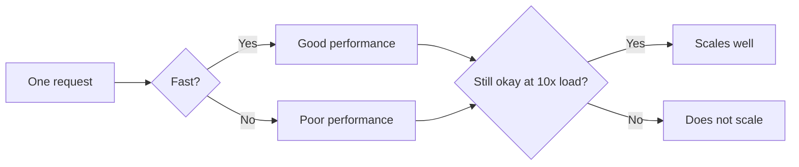
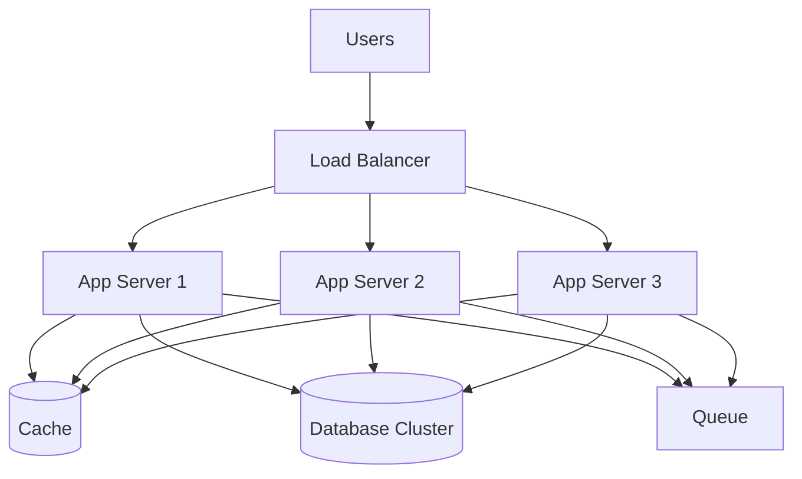

# Performance vs Scalability 

> Performance is about **how fast** a system responds right now.  
> Scalability is about **how well** that system keeps up when load grows.  
> They are related, but they are not the same problem.

## Table of Contents
- [The Problem This Solves](#-the-problem-this-solves)
- [The Core Idea](#-the-core-idea-in-plain-english)
- [How It Actually Works](#-how-it-actually-works)
- [Performance vs Scalability](#-performance-vs-scalability)
- [Common Mistakes & Gotchas](#-common-mistakes--gotchas)
- [When to Use Which Lens](#-when-to-use-which-lens)
- [TL;DR / Cheatsheet](#-tldr--cheatsheet)

---

## 🤔 The Problem This Solves

When people say, “the system is slow,” they might be talking about two very different things:

1. **A single request is slow**  
   Example: one API call takes 4 seconds instead of 200 ms.

2. **The whole system collapses under growth**  
   Example: the app feels fine with 100 users, but at 10,000 users the database melts, requests queue up, and everything crawls.

If you mix these up, you optimize the wrong thing.

You might spend a week adding caches and load balancers when the real issue is one bad SQL query.  
Or you might make one endpoint fast, but ignore the fact that the architecture will break the moment traffic doubles.

---

## 🧠 The Core Idea (in plain English)

Think of a restaurant.

- **Performance** = how quickly one customer gets their food.
- **Scalability** = how well the restaurant handles more customers without falling apart.

A tiny restaurant can be **fast** for 5 customers and still be **unscalable** because it has only one chef and one stove.  
A huge restaurant can be **scalable** but still feel **slow** if the kitchen process is sloppy.

So the key point is:

> **Performance is about latency and responsiveness.**  
> **Scalability is about capacity and growth.**

A system can have:
- good performance, bad scalability
- bad performance, good scalability
- good performance, good scalability
- bad performance, bad scalability

Those are different axes, not one sliding scale.

---

## 🔍 How It Actually Works

### 1) What “performance” usually means

Performance is usually measured by things like:

- **Latency**: how long one request takes
- **Throughput**: how many requests per second a system can process
- **CPU / memory efficiency**
- **I/O speed**
- **Tail latency**: the slowest 1% of requests, which often ruins UX

For users, performance feels like:

- “The page opens instantly.”
- “The API reply is snappy.”
- “Search results appear fast.”

For engineers, performance often means:

- less waiting
- fewer bottlenecks
- tighter execution paths
- better use of resources

### 2) What “scalability” usually means

Scalability is about whether the system can handle growth without a redesign.

Growth can mean:

- more users
- more requests
- more data
- more regions
- more concurrent jobs

A scalable system can usually absorb growth by doing one or more of these:

- add more servers
- partition data
- introduce queues
- cache aggressively
- split responsibilities
- keep state out of single machines

### 3) The hidden trap

A common mistake is to assume:

> “If I make it fast, it will scale.”

Not always.

A single in-memory data structure might be lightning fast, but it only works on one machine.  
As soon as traffic grows, that one machine becomes the ceiling.

Likewise:

> “If I scale it horizontally, performance will automatically improve.”

Also not always.

If every request has to make 12 network calls and hit a slow database, adding more servers just creates more expensive slowness.

---

## 📈 Simple Mental Model

---

## ⚖️ Performance vs Scalability

| Aspect | Performance | Scalability |
|---|---|---|
| Main question | “How fast is it?” | “How well does it grow?” |
| Focus | Latency, responsiveness | Capacity, growth, resilience under load |
| User experience | Snappy UI, quick API response | System stays usable as traffic rises |
| Typical bottleneck | Slow code, bad query, disk I/O, network hops | Single points of contention, shared state, DB limits |
| Common fix | Optimize the hot path | Add replicas, partition, cache, queue, decouple |
| Measured by | p50/p95 latency, throughput, CPU, memory | Max supported users, request volume, data size, horizontal growth |
| Good example | 100 ms API response | Same API still works at 100x traffic |
| Bad mistake | Making one request fast but ignoring growth | Scaling infrastructure while keeping a slow design |

### The easiest way to remember it

- **Performance = speed**
- **Scalability = headroom**

If you only remember one line, remember this:

> A fast system is not automatically a scalable system.

---

## 🔧 How Engineers Improve Performance

These are the usual suspects:

### A) Reduce unnecessary work
- Remove repeated computations
- Avoid extra serialization/deserialization
- Stop doing the same lookup over and over

### B) Cut network round trips
- Batch requests
- Use caching
- Avoid chatty services

### C) Fix slow storage access
- Add proper indexes
- Read fewer rows
- Avoid full table scans
- Use the right data model

### D) Move expensive work off the critical path
- Use async jobs
- Put heavy tasks in queues
- Precompute results

### E) Improve hot paths
- Profile first
- Optimize what actually matters
- Do not guess

> [!IMPORTANT]
> Performance work without profiling is usually just expensive superstition.

---

## 🏗️ How Engineers Improve Scalability

Scalability usually means reducing shared bottlenecks.

### A) Horizontal scaling
Add more machines instead of making one machine bigger.

- Good for stateless services
- Works well with load balancers
- Common in web apps

### B) Caching
Store frequently used data closer to the consumer.

- Reduces load on databases
- Improves response time
- Helps both performance and scalability

### C) Queues and async processing
Move slow work out of the user’s request path.

- Email sending
- Video processing
- Report generation
- Notifications

### D) Partitioning / sharding
Split data across multiple storage nodes.

- Useful when one database becomes too large
- Also helps distribute write load

### E) Stateless services
Keep session/state outside the app server when possible.

- Easier to scale out
- Easier to replace instances
- Less sticky routing pain

---

## 🧪 Concrete Example

### Case 1: Fast but not scalable

You build a recommendation engine that stores all state in RAM on one server.

- Requests are fast
- No network hop for reads
- Great latency

But:

- memory fills up
- one machine becomes the limit
- if the server dies, state is gone
- traffic growth hits a wall

This is **good performance**, **bad scalability**.

### Case 2: Scalable but slow

You split the system across 20 servers, but every request still triggers:

- 1 auth check
- 3 service calls
- 2 database reads
- 1 cache miss
- 1 remote payment lookup

Now the architecture can handle more traffic in theory, but each request is still painful.

This is **better scalability**, but **poor performance**.

### Case 3: Good performance and good scalability

You:
- cache hot data
- keep services stateless
- queue heavy jobs
- index the DB correctly
- partition large tables
- profile and optimize the actual bottleneck

Now a request is fast **and** the system can grow.

That is the real target.

---

## 🧱 A Useful Distinction: Vertical vs Horizontal Scaling

| Type | Meaning | Pros | Cons |
|---|---|---|---|
| Vertical scaling | Add more power to one machine | Simple, fewer moving parts | Eventually hits hardware limits, expensive jump |
| Horizontal scaling | Add more machines | Better growth path, more resilient | More complexity, coordination overhead |

Vertical scaling can improve **performance** for a while.  
Horizontal scaling is usually the long-term answer for **scalability**.

But horizontal scaling is not free. It adds:
- load balancing
- distributed failure modes
- consistency issues
- networking overhead

So the trade-off is real.

---

## ⚠️ Common Mistakes & Gotchas

### 1) Treating them like synonyms
They are not synonyms.

A system can be:
- fast and fragile
- slow and scalable
- fast and scalable
- slow and fragile

### 2) Optimizing the wrong layer
Fixing frontend rendering will not help if the database query is the real bottleneck.

### 3) Scaling a bad design
Throwing servers at a poorly designed system only hides the pain for a bit.

### 4) Ignoring tail latency
Average response time can look fine while the slowest requests are terrible.  
Users remember the slow ones.

### 5) Forgetting coordination costs
More servers mean more coordination, more network hops, and more failure points.

> [!WARNING]
> Distributed systems often trade local simplicity for global complexity. That trade is where many “scaling” bugs are born.

### 6) Using “scalable” as a vague compliment
“Scalable” is not a vibe. It should mean something concrete:
- handles 10x traffic?
- handles 100x data?
- supports more teams?
- supports more regions?

Always ask: **scalable in what dimension?**

---

## 🧭 When to Use Which Lens

### Use **performance** thinking when:
- a user-facing action feels slow
- one endpoint is lagging
- a query is too expensive
- CPU, memory, or disk usage is too high on a single request path

### Use **scalability** thinking when:
- traffic is growing
- data volume keeps increasing
- one machine or one database is becoming a bottleneck
- you need to support more users without rewriting the system

### In real life, you usually need both
The healthiest system design discussions ask:

1. Is it fast enough now?
2. Will it still be okay when traffic grows?
3. What breaks first?
4. What do we do when that happens?

That is the actual engineer mindset.

---

## 📝 TL;DR / Cheatsheet

| Term | Meaning |
|---|---|
| Performance | How fast the system feels right now |
| Scalability | How well the system handles growth |
| Fast system | Low latency, good responsiveness |
| Scalable system | Can absorb more load without collapsing |
| Key idea | Performance is about speed; scalability is about headroom |

### Quick test
Ask these two questions:

- **Performance:** “Is this request fast?”
- **Scalability:** “Will this still work when traffic is 10x?”

### Final mental model

> **Performance is a stopwatch.**  
> **Scalability is a stress test.**

You need both.

---

## 🔗 Further Reading
- Vertical vs horizontal scaling
- Caching strategies
- Load balancing
- Database indexing
- Sharding and partitioning
- Queues and async processing
- Tail latency and p95/p99 response times
