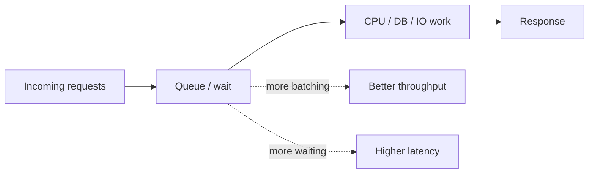

# Latency vs Throughput

> **Latency** is how long one thing takes. **Throughput** is how many things you can finish in a given amount of time.  
> They sound similar, but in system design they push you toward different engineering choices.

## Table of Contents

- [🤔 The Problem This Solves](#-the-problem-this-solves)
- [🧠 The Core Idea](#-the-core-idea-in-plain-english)
- [🔍 How It Actually Works](#-how-it-actually-works)
- [💻 Let's See It In C++](#-lets-see-it-in-c)
- [⚖️ Latency vs Throughput](#-latency-vs-throughput)
- [⚠️ Common Mistakes & Gotchas](#-common-mistakes--gotchas)
- [✅ When to Use What](#-when-to-use-what)
- [📝 TL;DR / Cheatsheet](#-tldr--cheatsheet)

---

## 🤔 The Problem This Solves

When you design a system, you usually care about **two different things**:

1. **How fast does one user request finish?**
2. **How much work can the system finish overall?**

Those are not the same question.

A system can be:
- **great at latency** - each request returns quickly, but total volume is mediocre.
- **great at throughput** - lots of requests are processed per second, but each individual request may wait longer.

This distinction shows up everywhere:
- APIs
- databases
- queues
- file processing
- game servers
- search engines
- payment systems

If you mix them up, you design the wrong thing.

> [!IMPORTANT]
> A system optimized for **throughput** is not automatically “fast” for a single user.  
> A system optimized for **latency** is not automatically “high capacity.”

---

## 🧠 The Core Idea (in plain English)

Think of a **restaurant**.

- **Latency** = how long *your order* takes from the moment you place it until the food lands on your table.
- **Throughput** = how many orders the restaurant can serve per hour.

Now the trade-off:

- One chef making one burger at a time may give you decent **latency** for a single order.
- A kitchen that batches 20 orders together may get much better **throughput**, but your individual order may wait longer before it starts.

That is the key mental model:

- **Latency** is about *response time*.
- **Throughput** is about *work rate*.

A system designer is constantly asking:
- “Do I want this one request to finish quickly?”
- “Or do I want the whole machine to chew through huge volume efficiently?”

Most real systems need both, but the priority changes by use case.

---

## 🔍 How It Actually Works

### 1) What latency really means

Latency is the time between **request start** and **response completion**.

For one request:

```text
latency = finish time - start time
```

People often talk about:
- **average latency**
- **p95 latency**: 95% of requests are faster than this
- **p99 latency**: 99% of requests are faster than this

That last part matters because averages can lie. A system with a “good average” can still have some painfully slow requests.

> [!WARNING]
> In production, users feel the **slow tail**, not the average.

---

### 2) What throughput really means

Throughput is the amount of work completed in a fixed time.

```text
throughput = requests completed / second
```

Or:
- files processed per minute
- messages consumed per second
- transactions committed per second

Throughput is about **capacity** and **sustained rate**.

If latency is “how fast one car reaches the destination,” throughput is “how many cars can pass through the road per minute.”

---

### 3) Why they are related, but not the same

They interact through **resource usage**.

If a request needs:
- CPU
- memory
- disk
- network
- locks
- database time

then those resources are shared. More work in the system means more waiting.

That waiting increases latency.

So usually:

- more batching / pipelining / parallelism → **higher throughput**
- but also more queueing / contention / waiting → **higher latency**

A very common pattern is:



The system is always balancing these two forces.

---

### 4) Why batching helps throughput

Batching means processing multiple items together.

Example:
- one database round trip for 100 rows instead of 100 separate round trips.

Why it helps:
- fewer network calls
- fewer syscalls
- better cache locality
- less overhead per item

Why it hurts:
- the first item waits for the batch to fill
- the batch may take longer to complete
- individual response time can get worse

So batching is usually a throughput play, not a latency play.

---

### 5) Why concurrency helps throughput, but only up to a point

Concurrency means doing multiple things “in flight” at once.

This improves throughput when:
- the system has idle time
- tasks are waiting on I/O
- you can overlap work

But after some point:
- contention goes up
- locks get hot
- cache misses increase
- context switching rises
- the DB becomes the bottleneck

Then more concurrency stops helping and can even make latency worse.

---

### 6) A simple rule of thumb

- If you care about **human experience**, focus on **latency**.
- If you care about **system capacity**, focus on **throughput**.
- If you care about **both**, measure **tail latency** and **sustained throughput** together.

---

## 💻 Let's See It In C++

Below are a few C++ examples to make the trade-off real.

### Example 1: Measuring latency for one task

```cpp
#include <chrono>
#include <iostream>
#include <thread>

using namespace std;
using namespace std::chrono;

void doWork() {
    this_thread::sleep_for(milliseconds(120));
}

int main() {
    auto start = high_resolution_clock::now();

    doWork();

    auto end = high_resolution_clock::now();
    auto latency = duration_cast<milliseconds>(end - start).count();

    cout << "Single request latency: " << latency << " ms\n";
    return 0;
}
```

This answers:
> “How long did this one request take?”

That is latency.

---

### Example 2: Measuring throughput for many tasks

```cpp
#include <chrono>
#include <iostream>
#include <thread>
#include <vector>

using namespace std;
using namespace std::chrono;

void doWork(int id) {
    this_thread::sleep_for(milliseconds(120));
}

int main() {
    const int tasks = 10;
    auto start = high_resolution_clock::now();

    for (int i = 0; i < tasks; ++i) {
        doWork(i);
    }

    auto end = high_resolution_clock::now();
    auto totalMs = duration_cast<milliseconds>(end - start).count();

    double throughput = (tasks * 1000.0) / totalMs;

    cout << "Processed " << tasks << " tasks in " << totalMs << " ms\n";
    cout << "Throughput: " << throughput << " tasks/sec\n";
    return 0;
}
```

This answers:
> “How many tasks per second can I process?”

That is throughput.

---

### Example 3: Batching to improve throughput

Here’s the classic trick: process a batch instead of one item at a time.

```cpp
#include <chrono>
#include <iostream>
#include <thread>
#include <vector>

using namespace std;
using namespace std::chrono;

void processBatch(const vector<int>& batch) {
    // Simulate fixed overhead + per-item work
    this_thread::sleep_for(milliseconds(20));   // setup cost
    this_thread::sleep_for(milliseconds(10 * batch.size())); // per item cost
}

int main() {
    vector<int> items(10);
    for (int i = 0; i < 10; ++i) items[i] = i;

    auto start = high_resolution_clock::now();

    // Process in two batches of 5
    processBatch(vector<int>(items.begin(), items.begin() + 5));
    processBatch(vector<int>(items.begin() + 5, items.end()));

    auto end = high_resolution_clock::now();
    auto totalMs = duration_cast<milliseconds>(end - start).count();

    cout << "Batched processing time: " << totalMs << " ms\n";
    return 0;
}
```

Why batching often helps:
- one setup cost per batch instead of per item
- more efficient overall use of the machine

But the first item in the second batch waits longer.

That is the trade-off in one line.

---

### Example 4: Sequential vs parallel thinking

This example shows the intuition, not a production-grade thread pool.

```cpp
#include <chrono>
#include <future>
#include <iostream>
#include <thread>
#include <vector>

using namespace std;
using namespace std::chrono;

void work(int ms) {
    this_thread::sleep_for(milliseconds(ms));
}

int main() {
    auto start = high_resolution_clock::now();

    future<void> f1 = async(launch::async, work, 200);
    future<void> f2 = async(launch::async, work, 200);
    future<void> f3 = async(launch::async, work, 200);

    f1.get();
    f2.get();
    f3.get();

    auto end = high_resolution_clock::now();
    auto totalMs = duration_cast<milliseconds>(end - start).count();

    cout << "Parallel completion time: " << totalMs << " ms\n";
    return 0;
}
```

If these tasks are independent, parallelism can improve throughput and sometimes latency too.

But:
- if you spawn too many threads, overhead rises
- if the bottleneck is a shared DB or lock, parallelism may not help
- if the task is CPU-bound and you exceed core count, things can get worse

---

## ⚖️ Latency vs Throughput

| Aspect | Latency | Throughput |
|---|---:|---:|
| Question it answers | How long does one request take? | How many requests finish per second? |
| Unit | ms, µs, seconds | req/s, ops/s, jobs/min |
| User feeling | “This feels fast” | “This system can handle load” |
| Best improved by | Less waiting, less queueing, less overhead | Batching, parallelism, pipelining, better resource utilization |
| Common danger | Low average but bad p95/p99 | High volume but bad per-request response time |
| Typical focus | API response, UI responsiveness, search results | Background jobs, pipelines, ingestion, analytics |

### Tiny rule

- **Latency** is about *time to first result*.
- **Throughput** is about *work done per unit time*.

---

## ⚠️ Common Mistakes & Gotchas

### 1) Thinking they are the same thing

They are not.

A system can have:
- low latency but low throughput
- high throughput but poor latency

That confusion causes bad architecture decisions.

---

### 2) Optimizing only the average

Average latency is nice for slides. Real users live in the tail.

A system with:
- 80 ms average
- but 2 second p99

is still annoying.

---

### 3) More concurrency is not always better

People see throughput improve and keep adding threads.

Then:
- locks serialize work
- memory pressure goes up
- CPU cache efficiency drops
- context switches explode

Throughput plateaus or drops.

---

### 4) Batching can quietly hurt UX

Batching is great for:
- ETL
- logging
- offline jobs
- large database writes

It is often bad for:
- chat messages
- search-as-you-type
- payment confirmation
- interactive APIs

If the user is waiting on the screen, latency matters more than raw throughput.

---

### 5) Measuring the wrong thing

You need to know what you are measuring:
- end-to-end latency?
- service latency?
- database latency?
- queue wait time?
- CPU time?

A system can look fast in one layer and slow in another.

---

### 6) Forgetting the queue

A lot of latency is not “doing work”; it is **waiting to do work**.

In overloaded systems, queue time dominates.
That is where p95/p99 get ugly.

---

## ✅ When to Use What

### Choose latency-first when:
- user interaction is involved
- the response is visible to a human
- real-time APIs matter
- timeouts are strict
- you need snappy UX

Examples:
- login
- autocomplete
- order placement
- chat
- payment authorization

### Choose throughput-first when:
- you are processing large volumes
- delay is acceptable
- work can be batched
- the system runs in the background

Examples:
- log ingestion
- analytics jobs
- image transcoding
- email campaigns
- data pipelines

### Choose both when:
- the system serves users and handles scale
- you need to keep p95 low while still supporting high load

Examples:
- search engines
- ride-hailing dispatch
- ecommerce checkout
- messaging systems

---

## 📝 TL;DR / Cheatsheet

- **Latency** = how long one request takes.
- **Throughput** = how many requests the system finishes per second.
- Lower latency usually means less waiting for a single request.
- Higher throughput usually means better resource utilization.
- Batching and concurrency often improve throughput.
- Batching and queueing often increase latency.
- Tail latency (**p95/p99**) matters more than averages in real systems.
- Measure both. Design for the one your product actually cares about.

> [!TIP]
> A useful engineer answer is rarely “latency or throughput.”  
> It is usually: **“Which one matters more here, and what is the acceptable trade-off?”**

---

## 🔗 Further Reading

- Queueing theory basics
- Little’s Law
- Tail latency and p99 design
- Backpressure in distributed systems
- Batching and pipelining patterns
