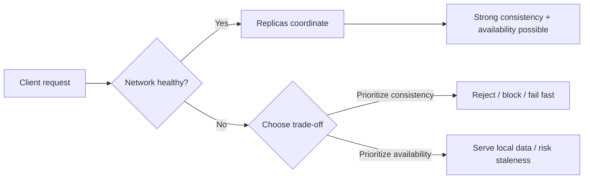

# Availability vs Consistency

> In distributed systems, **availability** and **consistency** are both desirable, but under a network partition you usually cannot have both at the same time. CAP theorem is the reason people stop hand-waving and start making explicit trade-offs.

## Table of Contents

- [The Problem This Solves](#the-problem-this-solves)
- [The Core Idea](#the-core-idea-in-plain-english)
- [CAP Theorem, in Practical Terms](#cap-theorem-in-practical-terms)
- [Availability vs Consistency](#availability-vs-consistency)
- [How It Actually Works](#how-it-actually-works)
- [Examples You Can Feel](#examples-you-can-feel)
- [AP vs CP Systems](#ap-vs-cp-systems)
- [Common Mistakes & Gotchas](#common-mistakes--gotchas)
- [When to Use What](#when-to-use-what)
- [TL;DR / Cheatsheet](#tldr--cheatsheet)

## 🤔 The Problem This Solves

When you run a system on **one machine**, life is simple:

- there is one source of truth,
- every read and write goes to the same place,
- and there is no need to worry about machines disagreeing with each other.

The moment you move to **multiple machines** - replicas, shards, regions, failover nodes, caches, queues - reality gets messy.

Now you have to answer questions like:

- What happens if one replica is stale?
- What happens if a network link breaks?
- Should the system keep serving requests or reject them until it is sure?
- If two users update the same data at the same time, which value wins?

CAP theorem exists to frame that mess in a useful way.

## 🧠 The Core Idea (in plain English)

Think of a distributed database like a team that keeps copies of the same notebook in different offices.

- **Consistency** means every office sees the same latest notebook contents.
- **Availability** means every office responds to requests, even if some offices are cut off.
- **Partition tolerance** means the system keeps running even when offices cannot talk to each other over the network.

The hard truth is this:

<mark>When a network partition happens, you must choose between being consistent and being available.</mark>

You cannot fully guarantee both at the same time during the partition.

## CAP Theorem, in Practical Terms

CAP is often stated as:

- **C** = Consistency
- **A** = Availability
- **P** = Partition tolerance

The real-world interpretation is more subtle than the classroom version:

### What CAP actually says

A distributed system cannot guarantee all three properties simultaneously **when a network partition occurs**.

That means:

- **P is not optional** in distributed systems. Networks fail.
- During a partition, you must trade off between:
  - **C**: refuse or delay some requests to avoid incorrect answers
  - **A**: keep answering requests, even if some answers may be stale or conflicting

> [!IMPORTANT]
> The “choose any two out of three” slogan is a simplification. In practice, partition tolerance is something you design for, not a checkbox you can casually turn off.

## Availability vs Consistency

These two get mixed up all the time, so let’s separate them properly.

| Property | Meaning | What the user experiences | Typical trade-off |
|---|---|---|---|
| **Consistency** | All nodes agree on the latest committed value | “I read what was just written” | May reject requests or wait for coordination |
| **Availability** | Every request receives a non-error response | “The system always answers” | May return stale or divergent data |

### Consistency, in plain English

Consistency means that after a write succeeds, later reads should not lie to you.

If I update my profile picture, I should not immediately see the old one when I refresh.

In stronger consistency models, the system behaves like there is **one single copy** of the data, even though it is really replicated.

### Availability, in plain English

Availability means the system keeps responding.

Even if one node is down, or a region is isolated, the system should still answer requests instead of timing out or refusing everything.

That does **not** automatically mean the answer is correct or current. It just means the system is alive and replying.

> [!TIP]
> A system can be “available” and still be wrong. That is the part juniors usually miss.

## How It Actually Works

Here’s the mental model that helps.

### Normal case: no partition

When the network is healthy, a distributed system can often give you both:

- strong consistency,
- and good availability.

Because nodes can coordinate, replicate, and agree.

### Failure case: partition happens

Now imagine the cluster splits into two groups that cannot communicate.

```
Client --> Node A      X      Node B <-- Client
           \                 /
            \--- no network --/
```

At this point, the system has a choice:

### Option 1: preserve consistency

The system says:

- “I cannot be sure the other side has seen this write.”
- “I will not answer this write/read yet.”
- “Come back later.”

That protects correctness, but hurts availability.

### Option 2: preserve availability

The system says:

- “I will keep serving requests locally.”
- “I will accept writes here.”
- “I’ll reconcile later.”

That preserves responsiveness, but you may get stale reads, conflicts, or divergent state.

### The key insight

<mark>Under partition, consistency and availability pull in opposite directions.</mark>

You can lean toward one, but not fully maximize both.

## Mermaid Diagram

A simple picture of the trade-off:



## Examples You Can Feel

### 1) Banking balance

Suppose a bank account has ₹10,000.

Two ATMs go offline from each other for a while.

If both ATMs keep allowing withdrawals independently, the account can go negative or diverge.

For banking, **consistency** matters more than always answering immediately.

Better to say:

- “Transaction temporarily unavailable”
- than to let the system create money from nowhere.

### 2) Social media feed likes

A like counter being off by a few seconds is usually acceptable.

If a post shows 101 likes now and 102 after refresh, that is fine.

For this kind of feature, **availability** often matters more than immediate consistency.

### 3) Shopping cart

A cart can sometimes be eventually consistent.

If one replica is briefly stale, the user can still keep shopping.

The critical part is usually the final checkout step, which should be much stricter.

## AP vs CP Systems

This is the practical CAP vocabulary you’ll hear in interviews and architecture reviews.

| System type | Optimizes for | Under partition | Typical behavior |
|---|---|---|---|
| **CP** | Consistency + Partition tolerance | May lose availability | Rejects / blocks / elects leader / waits for quorum |
| **AP** | Availability + Partition tolerance | May lose consistency | Serves stale or conflicting data, resolves later |

### CP systems

These systems prefer correctness over continuous response.

Examples often discussed in this bucket include systems that require a quorum or leader agreement before accepting writes.

That means if the cluster cannot agree, it would rather refuse the request than risk inconsistency.

### AP systems

These systems prefer to keep serving.

They accept that the data may temporarily disagree across nodes, and they reconcile later.

This is common in systems built for massive scale, where “always answer” is more important than “always perfectly current.”

> [!NOTE]
> Real systems are rarely pure AP or pure CP everywhere. Many systems are **hybrids**: different operations get different guarantees.

## How Replication Changes the Story

Replication helps availability because another node can take over if one fails.

But replication also creates the coordination problem.

The more copies you have, the more you need to answer:

- Which copy is authoritative?
- How do writes propagate?
- Do readers wait for confirmation?
- What happens when replicas conflict?

Common strategies include:

- **Leader-based replication**: one primary accepts writes, followers replicate.
- **Quorum writes**: a write succeeds only after enough replicas acknowledge it.
- **Eventual consistency**: replicas sync later, not immediately.
- **Conflict resolution**: last-write-wins, vector clocks, application-level merge, CRDTs.

## A Tiny Code Example

Here is a simplified mental model of a write path.

```python
def write_value(node, key, value):
    if not node.can_reach_quorum():
        raise Exception("Unavailable: cannot guarantee consistency right now")

    node.commit(key, value)
    return "ok"
```

That is a CP-style decision: fail rather than risk accepting a write that other replicas have not agreed to.

Now compare with an AP-style version:

```python
def write_value(node, key, value):
    node.store_locally(key, value)
    node.enqueue_replication(key, value)
    return "ok"
```

That keeps the system responsive, but another node may still read an older value for a while.

## Common Mistakes & Gotchas

> [!WARNING]
> The biggest beginner mistake is thinking CAP is a menu where you pick one property and get the others for free. That is not how distributed systems work.

### Mistake 1: “Consistency means the data is correct forever”

No. Consistency means nodes agree according to the chosen model.

You still need:
- validation,
- authorization,
- application correctness,
- and sane conflict handling.

### Mistake 2: “Availability means the data is correct”

Also no.

Availability only means the system responds. It may respond with stale data.

### Mistake 3: “Partition tolerance is rare, so ignore it”

This is dangerous.

In distributed systems, partitions are not exotic edge cases. They are expected failures.

Networks drop packets. Regions isolate. Routers misbehave. Timeouts happen.

### Mistake 4: “CAP applies to all consistency models equally”

CAP is about **strong consistency** trade-offs under partition. It is not a blanket statement that all forms of consistency are impossible.

### Mistake 5: “Single-node systems need CAP choices”

Not really. CAP becomes relevant when you have distributed state and network communication between nodes.

## When to Use What

### Prefer stronger consistency when:

- money is involved,
- inventory must not oversell,
- permissions and access control must be accurate,
- duplicate side effects are expensive,
- wrong answers are worse than delayed answers.

### Prefer higher availability when:

- users can tolerate temporary staleness,
- you care more about responsiveness than immediate correctness,
- the data can be reconciled later,
- the system is read-heavy and user-facing.

### Good rule of thumb

- **Checkout, payment, auth, ledger, inventory** → lean CP
- **Likes, views, feeds, analytics, presence** → lean AP

That is not a law. It is just the engineering instinct that usually holds up.

## TL;DR / Cheatsheet

| Term | One-line meaning |
|---|---|
| **Consistency** | Everyone sees the same latest truth |
| **Availability** | Every request gets a response |
| **Partition tolerance** | The system survives network splits |
| **CAP theorem** | During a partition, you choose between consistency and availability |

### Memory hook

- **Consistency** = “Don’t lie to me.”
- **Availability** = “Don’t ignore me.”
- **Partition** = “The network broke.”
- **Trade-off** = “Pick which pain you can live with.”

### Final mental model

If the network is healthy, distributed systems can often look great.

If the network breaks, the system must decide:

- **stay correct and possibly go offline**, or
- **stay online and possibly become stale/inconsistent**.

That is the real CAP theorem conversation.

## 🔗 Further Reading

- Brewer’s CAP theorem
- Strong vs eventual consistency
- Quorum reads/writes
- Leader election
- Conflict resolution strategies
