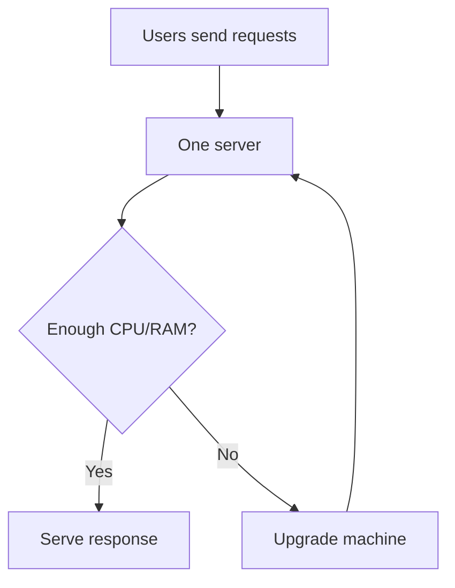
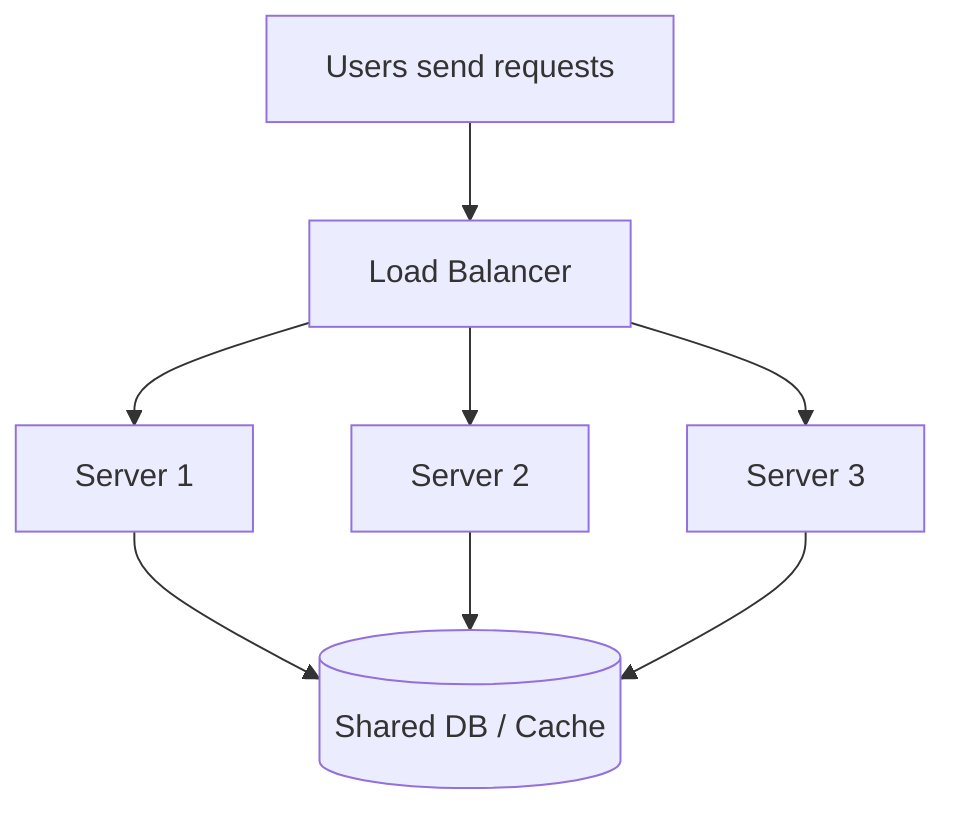

# Scaling: Vertical vs Horizontal, w/ C++ Code

> Scaling is just making a system handle more traffic, more users, or more work without falling over. The two classic ways are: make one machine stronger, or use more machines. This follows the senior-dev explainer structure in your notes: plain-English first, then the technical layer. 


## Why this exists?

At the start, one server is usually enough.

Then traffic grows:

* more users
* more requests per second
* bigger data
* longer response times
* more memory pressure

At some point, the system starts slowing down or crashing. Scaling is how you keep the app usable as load increases.


## The core idea

Think of a restaurant.

* **Vertical scaling** = make one chef faster and the kitchen bigger.
* **Horizontal scaling** = open more kitchens and send customers to whichever one is free.

Both work. They solve the same problem in different ways.

### In one line

* **Vertical scaling** means adding more CPU, RAM, disk, or better hardware to the same machine.
* **Horizontal scaling** means adding more machines and splitting the load across them.

<br>


## Vertical scaling

### What it means

You keep **one server**, but make it stronger.

Examples:

* 2 CPU cores → 16 CPU cores
* 8 GB RAM → 64 GB RAM
* HDD → SSD → NVMe
* small VM → bigger VM

### Why people like it

* Simple to understand
* Very little code change
* Easy deployment
* No distributed-system headache

### The catch

It has a ceiling.

A machine can only get so big, so fast, and so expensive.

Also, one machine is a **single point of failure**. If it dies, everything dies.


## Horizontal scaling

### What it means

You add more servers and split traffic across them.

Instead of:

```text
1 server handles 100% of traffic
```

you do:

```text
Load balancer
   ├── Server A
   ├── Server B
   ├── Server C
   └── Server D
```

### Why people like it

* Scales much further
* Better fault tolerance
* Easier to grow gradually
* Handles spikes better

### The catch

* More moving parts
* Harder debugging
* Need load balancing
* Shared state becomes a problem


## Vertical vs Horizontal

| Aspect         | Vertical Scaling                                    | Horizontal Scaling                                     |
| -------------- | --------------------------------------------------- | ------------------------------------------------------ |
| Add what?      | More power to one machine                           | More machines                                          |
| Complexity     | Low                                                 | High                                                   |
| Cost curve     | Gets expensive fast                                 | Usually better long-term                               |
| Failure impact | One box dies → service dies                         | One box dies → others keep serving                     |
| State handling | Easy locally                                        | Harder; state must be shared or externalized           |
| Best for       | Small/medium systems, early stage, simple workloads | Large systems, high availability, cloud-native systems |


## How it works in real life

### Vertical scaling flow



### Horizontal scaling flow




## C++ example: vertical scaling mindset

Vertical scaling is mostly a **machine-level** decision, not a code-level trick.

But your code should still be designed to **use the machine well**.
For example, if the server has multiple CPU cores, a multi-threaded C++ server can use them.

### Example: thread-safe request counter

```cpp
#include <iostream>
#include <thread>
#include <vector>
#include <mutex>
#include <atomic>

class RequestStats {
private:
    std::atomic<long long> totalRequests{0};

public:
    void recordRequest() {
        totalRequests.fetch_add(1, std::memory_order_relaxed);
    }

    long long getTotalRequests() const {
        return totalRequests.load(std::memory_order_relaxed);
    }
};

void handleRequests(RequestStats& stats, int numRequests) {
    for (int i = 0; i < numRequests; ++i) {
        stats.recordRequest();
    }
}

int main() {
    RequestStats stats;

    const int numThreads = 8;   // uses more CPU cores if the machine has them
    const int requestsPerThread = 100000;

    std::vector<std::thread> workers;
    for (int i = 0; i < numThreads; ++i) {
        workers.emplace_back(handleRequests, std::ref(stats), requestsPerThread);
    }

    for (auto& t : workers) {
        t.join();
    }

    std::cout << "Total requests: " << stats.getTotalRequests() << "\n";
    return 0;
}
```

### What this shows

* One machine
* Many threads
* Better use of available CPU
* Still a single process, single box

This is the kind of code that benefits from vertical scaling because more cores can help it run faster.


## C++ example: horizontal scaling mindset

Horizontal scaling changes the design.

You do **not** want each server to depend on local memory for important state, because another server will not have that memory.

So the service should be as **stateless** as possible.

### Example: route a user to a shard/server by hash

```cpp
#include <iostream>
#include <string>
#include <vector>
#include <functional>

int pickServer(const std::string& userId, int serverCount) {
    std::hash<std::string> hasher;
    size_t h = hasher(userId);
    return static_cast<int>(h % serverCount);
}

int main() {
    std::vector<std::string> servers = {
        "server-1",
        "server-2",
        "server-3",
        "server-4"
    };

    std::string userId = "user_42";
    int index = pickServer(userId, static_cast<int>(servers.size()));

    std::cout << "Route " << userId << " to " << servers[index] << "\n";
    return 0;
}
```

### What this shows

* Same logic can run on many servers
* Requests can be distributed by a load balancer or hashing
* State is no longer locked inside one machine


## State is the real problem in horizontal scaling

This trips up almost everyone at first.

When you scale horizontally, the app is no longer “one box with memory.”

That means:

* local cache may not be shared
* session data may disappear on another server
* in-memory counters become inconsistent
* file uploads on one server may not exist on another

### Fixes

* Put sessions in Redis / DB
* Put files in object storage like S3
* Use a shared database
* Make services stateless where possible

> [!WARNING]
> If your app depends on local memory for user state, horizontal scaling will break it in subtle ways. It may work in dev and fail in production as soon as requests hit different servers.


## When to use which

| Situation                           | Better choice     |
| ----------------------------------- | ----------------- |
| Early-stage app                     | Vertical first    |
| Simple deployment                   | Vertical first    |
| Need quick improvement              | Vertical first    |
| Growing traffic                     | Horizontal        |
| High availability required          | Horizontal        |
| Need to survive server failure      | Horizontal        |
| Heavy CPU-bound workload on one box | Vertical can help |
| Massive user base                   | Horizontal        |

### Practical rule

Start vertical.
Move horizontal when vertical stops being enough.

That is the usual path.


## Common mistakes

> [!IMPORTANT]
> Vertical scaling is not “bad.” It is often the fastest and cheapest way to buy time.

> [!WARNING]
> Horizontal scaling does **not** automatically make your app scalable if your database cannot keep up. The bottleneck often moves to the DB, cache, or queue.

> [!CAUTION]
> Keeping user sessions in local memory on each server is a classic scaling bug. It works until the load balancer sends the next request to a different machine.


## A simple mental model

### Vertical scaling

You are making **one worker stronger**.

### Horizontal scaling

You are hiring **more workers**.

The job is the same. The operational shape is different.


## Quick recap

* **Vertical scaling** = bigger machine
* **Horizontal scaling** = more machines
* Vertical is simpler, but it has limits
* Horizontal scales further, but adds distributed-system complexity
* Stateless design is the key to horizontal scaling
* Shared state should go in DB / Redis / object storage, not local RAM


## Tiny cheat sheet

```text
Need fast, simple improvement?  → Vertical
Need resilience and large-scale growth? → Horizontal
Need to keep user state? → Externalize it
Need better CPU use on one box? → Multi-threading helps vertical scaling
Need more traffic capacity? → Add servers behind a load balancer
```

