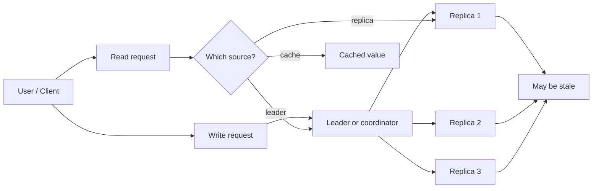

# Consistency Patterns

> Consistency patterns are the rules and tactics you use to keep distributed systems from lying to people.  
> The hard part is that "correct" often means **different things at different times** depending on how fresh the data has to be.

## Table of Contents

- [The Problem This Solves](#-the-problem-this-solves)
- [The Core Idea](#-the-core-idea-in-plain-english)
- [How It Actually Works](#-how-it-actually-works)
- [Let's See It In Code](#-lets-see-it-in-code)
- [Consistency Patterns vs Each Other](#-consistency-patterns-vs-each-other)
- [Common Mistakes & Gotchas](#-common-mistakes--gotchas)
- [When to Use It (and When Not To)](#-when-to-use-it-and-when-not-to)
- [TL;DR / Cheatsheet](#-tldr--cheatsheet)
- [Further Reading](#-further-reading)

## 🤔 The Problem This Solves

In a single-process app, data is easy to reason about.

You update a variable. You read it back. Done.

In a distributed system, that clean story breaks immediately:

- data is copied across machines,
- writes take time to propagate,
- reads may hit stale replicas,
- network partitions happen,
- caches lie,
- retries duplicate work.

So the real question is not just **"is the data correct?"**  
It is **"correct according to which guarantee, and for how long can we tolerate it being stale?"**

That is what consistency patterns are about.

> [!IMPORTANT]
> Most production systems are not "fully consistent" or "fully inconsistent." They pick a consistency model per operation, per dataset, or even per user flow.

## 🧠 The Core Idea (in plain English)

A **consistency pattern** is a strategy for managing the gap between **the latest truth** and **what different parts of the system currently believe**.

Think of it like a group chat with a delay:

- one person says something,
- some people hear it immediately,
- others see it a few seconds later,
- and a few may miss the update until they reconnect.

A consistency pattern decides:

1. **How stale data is allowed to be**
2. **Who is allowed to read or write**
3. **How conflicts are resolved**
4. **When the system should block, retry, or reconcile**

The main trade-off is simple:

- **Stronger consistency** = fewer surprises, but often higher latency / lower availability
- **Weaker consistency** = faster and more available, but you must tolerate temporary disagreement

<mark>Consistency is not one thing.</mark> It is a toolbox of guarantees and implementation patterns.

## 🔍 How It Actually Works

### 1) The system usually has multiple copies of the same data

A distributed database or service often stores the same value in several places:

- primary / leader
- replicas / followers
- caches
- edge nodes
- client-side state

That means every read is a question:

- read the latest committed version?
- read a nearby replica?
- read cached data and accept staleness?
- wait until a quorum agrees?

### 2) Consistency patterns answer different questions

Here are the big ones you’ll see in real systems.

| Pattern | What it guarantees | Typical cost | Good for |
|---|---|---:|---|
| **Strong consistency** | Every read sees the latest successful write | Higher latency | Banking, inventory, auth state |
| **Linearizability** | Operations appear to happen in one global order | Highest coordination cost | Locks, leader election, critical state |
| **Sequential consistency** | Everyone sees the same order, but not necessarily real-time order | Medium-high | Shared state where real-time order is less important |
| **Read-your-writes** | A user always sees their own latest writes | Moderate | Profiles, posts, settings |
| **Monotonic reads** | Once you see a new value, you never go backward | Moderate | Feeds, timelines, session state |
| **Eventual consistency** | If updates stop, all replicas eventually converge | Low latency, high availability | Social feeds, counters, async systems |
| **Causal consistency** | Causally related updates are seen in order | Moderate | Chat, collaborative tools |
| **Quorum consistency** | Read/write success depends on enough replicas agreeing | Tunable | Distributed databases |
| **Write-through / write-behind cache consistency** | Cache and source of truth are kept in sync with a chosen policy | Varies | Cache-heavy systems |

### 3) The implementation pattern depends on the failure mode

A system usually uses one or more of these mechanisms:

- **Leader-based replication**: one node accepts writes, others follow
- **Quorums**: require enough replicas to confirm reads/writes
- **Versioning / timestamps**: detect which value is newer
- **Conflict resolution**: last-write-wins, merge functions, CRDTs
- **Invalidation**: throw away stale cache entries
- **Change streams / event logs**: propagate updates asynchronously
- **Idempotency keys**: protect against duplicates during retries

### 4) The real shape of the problem

Here is the mental model:



The system is always choosing between:

- **freshness**
- **speed**
- **availability**
- **simplicity**

And the "best" choice depends on the business rule, not on purity.

> [!WARNING]
> A lot of bugs come from pretending every read must be the latest read. That is expensive, and in some systems it is not even necessary.

## 💻 Let's See It In Code

### Example 1: Read-through cache with stale data risk

This is the simplest version of a consistency pattern: keep a cache in front of a database.

#### Python

```python
from dataclasses import dataclass
from typing import Optional
import time

@dataclass
class UserProfile:
    user_id: str
    name: str
    updated_at: float

# Simulated stores
DATABASE = {
    "u1": UserProfile("u1", "Arin", time.time())
}
CACHE = {}

def get_user_profile(user_id: str) -> Optional[UserProfile]:
    # Read from cache first
    if user_id in CACHE:
        return CACHE[user_id]

    # Fall back to database
    profile = DATABASE.get(user_id)
    if profile:
        CACHE[user_id] = profile  # cache it
    return profile

def update_user_profile(user_id: str, new_name: str) -> None:
    # Write to database
    DATABASE[user_id] = UserProfile(user_id, new_name, time.time())

    # Invalidate cache so future reads don't use stale data
    CACHE.pop(user_id, None)

profile = get_user_profile("u1")
print(profile)

update_user_profile("u1", "Arindal")
profile = get_user_profile("u1")
print(profile)
```

What matters here:

- if you forget cache invalidation, readers may see old data
- if invalidation fails, the cache becomes a liar
- if you update the cache before the DB write commits, you can make stale state look "fresh"

#### C++

```cpp
#include <iostream>
#include <unordered_map>
#include <string>
#include <optional>

struct UserProfile {
    std::string userId;
    std::string name;
    long long updatedAt;
};

std::unordered_map<std::string, UserProfile> database;
std::unordered_map<std::string, UserProfile> cache;

std::optional<UserProfile> getUserProfile(const std::string& userId) {
    auto cacheIt = cache.find(userId);
    if (cacheIt != cache.end()) {
        return cacheIt->second;
    }

    auto dbIt = database.find(userId);
    if (dbIt == database.end()) return std::nullopt;

    cache[userId] = dbIt->second;
    return dbIt->second;
}

void updateUserProfile(const std::string& userId, const std::string& newName, long long ts) {
    database[userId] = UserProfile{userId, newName, ts};
    cache.erase(userId); // invalidate stale entry
}

int main() {
    database["u1"] = {"u1", "Arin", 1000};

    auto p1 = getUserProfile("u1");
    if (p1) std::cout << p1->name << "\n";

    updateUserProfile("u1", "Arindal", 2000);

    auto p2 = getUserProfile("u1");
    if (p2) std::cout << p2->name << "\n";
}
```

### Example 2: Version-based conflict detection

A very common pattern is **optimistic concurrency control**: read a version, update only if version is unchanged.

#### Python

```python
from dataclasses import dataclass

@dataclass
class Document:
    doc_id: str
    content: str
    version: int

DB = {
    "d1": Document("d1", "Hello", 1)
}

def read_doc(doc_id: str) -> Document:
    return DB[doc_id]

def update_doc(doc_id: str, new_content: str, expected_version: int) -> bool:
    current = DB[doc_id]
    if current.version != expected_version:
        return False  # someone else updated it first

    DB[doc_id] = Document(doc_id, new_content, current.version + 1)
    return True

doc = read_doc("d1")
ok = update_doc("d1", "Hello world", expected_version=doc.version)
print(ok)  # True
```

This protects you from the classic **lost update** problem.

### Example 3: Quorum-style thinking

A quorum system says: "I do not trust one replica alone. I want enough of them to agree."

The idea is simple:

- write to **W** replicas
- read from **R** replicas
- if `R + W > N`, you can often ensure overlap between read and write sets

That is why quorum systems are so useful in distributed databases.

> [!TIP]
> You do not need to memorize the math first. Memorize the intuition: quorum means "enough copies agreed that I can trust the answer."

## ⚖️ Consistency Patterns vs Each Other

| Pattern | Read freshness | Write latency | Availability | Complexity | Typical use |
|---|---:|---:|---:|---:|---|
| Strong consistency | Latest | Higher | Lower under partition | Higher | Money, auth, inventory |
| Eventual consistency | May be stale | Lower | Higher | Lower-medium | Feeds, analytics, counters |
| Read-your-writes | Fresh for the writer | Medium | Medium-high | Medium | User dashboards, settings |
| Monotonic reads | Never goes backward | Medium | Medium-high | Medium | Session continuity |
| Causal consistency | Respects dependency order | Medium | Medium | Higher | Collaboration, messaging |
| Quorum consistency | Tunable | Tunable | Tunable | Higher | Distributed stores |

### How to think about the trade-offs

- **Strong consistency** is the "I will wait for truth" model.
- **Eventual consistency** is the "I will move fast and fix up later" model.
- **Read-your-writes** is a human-friendly guarantee.
- **Monotonic reads** prevent confusing time travel.
- **Causal consistency** preserves meaning, not just order.

## ⚠️ Common Mistakes & Gotchas

> [!WARNING]
> Juniors often confuse **cache freshness** with **database consistency**. They are related, but not the same problem.

### 1) Assuming the cache is the source of truth
The cache is usually a performance layer, not the canonical store.

### 2) Ignoring retry duplicates
If a client retries a write after a timeout, the server may process it twice unless you use idempotency keys.

### 3) Using timestamps blindly
Clock skew across machines can make "latest by timestamp" wrong.

### 4) Overusing strong consistency
You pay for coordination. If the business does not need it, you are wasting latency and throughput.

### 5) Forgetting user-visible anomalies
Even if the system is technically correct, users hate seeing:
- profile updated on one page but not another
- a post they just made disappearing from feed briefly
- a counter going backwards

That is why read-your-writes and monotonic reads matter.

### 6) Treating eventual consistency as a shrug
Eventual consistency is not "anything goes." It still needs:
- convergence
- conflict handling
- clear user experience for temporary staleness

## ✅ When to Use It (and When Not To)

### Use stronger consistency when:
- you are moving money
- you are enforcing permissions
- you are allocating scarce inventory
- duplicates or stale reads cause real damage
- correctness matters more than latency

### Use weaker or tunable consistency when:
- you are showing feeds, likes, or counters
- small temporary staleness is acceptable
- you need high availability across regions
- you can reconcile later with background jobs or events

### Good rule of thumb

If a stale read can cause:
- financial loss,
- security bugs,
- permanent bad state,

then bias toward stronger consistency.

If a stale read only causes:
- minor UI lag,
- temporary mismatch,
- cosmetic inconsistency,

then bias toward speed and availability.

## 📝 TL;DR / Cheatsheet

- **Consistency patterns** define how and when different parts of a distributed system agree on data.
- The main tension is **freshness vs latency vs availability**.
- Common patterns:
  - **strong consistency**
  - **eventual consistency**
  - **read-your-writes**
  - **monotonic reads**
  - **causal consistency**
  - **quorum consistency**
- Most real systems use a **mix**, not one universal rule.
- Caches, replicas, retries, and network delays are where consistency bugs show up.
- The right question is not "is it consistent?"  
  It is **"consistent enough for this user flow?"**

> [!IMPORTANT]
> The best consistency strategy is the one that matches the business consequence of being wrong.

## 🔗 Further Reading

- CAP theorem
- Linearizability vs sequential consistency
- Distributed transactions
- Optimistic concurrency control
- CRDTs
- Quorum reads and writes
- Cache invalidation strategies
