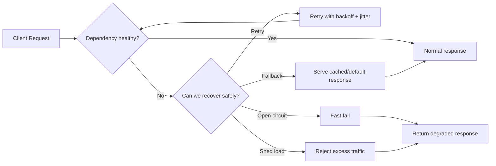
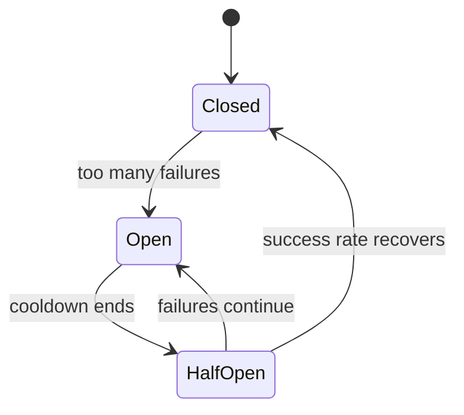

# Availability Patterns

> Availability patterns are the tricks we use to keep a system responsive when things start failing. The goal is not “perfect uptime forever” - it’s to fail gracefully, recover fast, and avoid turning one bad dependency into a full outage.

## Table of Contents

- [The Problem This Solves](#-the-problem-this-solves)
- [The Core Idea](#-the-core-idea-in-plain-english)
- [How It Actually Works](#-how-it-actually-works)
- [Let's See It In Code](#-lets-see-it-in-code)
- [Availability Patterns vs Each Other](#-availability-patterns-vs-each-other)
- [Common Mistakes & Gotchas](#-common-mistakes--gotchas)
- [When to Use It (and When Not To)](#-when-to-use-it-and-when-not-to)
- [TL;DR / Cheatsheet](#-tldr--cheatsheet)
- [Further Reading](#-further-reading)

---

## 🤔 The Problem This Solves

Real systems fail in boring ways.

A database gets slow. A downstream API times out. A queue backs up. A node dies. A network blips for two seconds and suddenly every request thread is blocked waiting for something that is not coming.

That is the real enemy: **cascading failure**.

Availability patterns exist to answer a simple question:

> “When one part of the system is sick, how do we keep the rest of the system usable?”

You usually do **not** want every request to wait forever.
You usually do **not** want every caller to keep hammering a dead service.
And you definitely do **not** want one dependency outage to drag down the whole app like a bad wheel on a shopping cart.

---

## 🧠 The Core Idea (in plain English)

Think of availability patterns like emergency driving habits.

- **Timeouts** are “I’m not waiting forever at this traffic light.”
- **Retries** are “I’ll try one more route if the first road is blocked.”
- **Circuit breakers** are “This highway is jammed; I’m not even going to enter it for a while.”
- **Fallbacks** are “Fine, I’ll take the side street and still get somewhere useful.”
- **Bulkheads** are “Keep the engine room separate from the passenger cabin so one fire does not sink the whole ship.”
- **Load shedding** is “We are overloaded, so we intentionally reject some traffic before the whole system collapses.”

<mark>Availability patterns are less about making failures disappear and more about making failures contained, predictable, and survivable.</mark>

That’s the whole game.

---

## 🔍 How It Actually Works

Most availability patterns are built around one of three moves:

1. **Stop waiting too long**
2. **Stop repeating dangerous work blindly**
3. **Stop letting one failure spread**

Here is the practical picture.



### 1) Timeouts: the first line of defense

A timeout says: “If the dependency does not answer within X milliseconds, treat it as failed.”

Without a timeout, a slow service is almost worse than a dead service, because your threads keep waiting and waiting and waiting.

> [!IMPORTANT]
> Timeouts should be set based on the **expected latency budget** of the request path, not guessed randomly.

### 2) Retries: only when the failure is likely temporary

Retries help when failure is caused by a transient problem:
- packet loss
- short network hiccups
- brief overload
- momentary lock contention

But retries can also make things worse if you use them carelessly. If the downstream service is already dying, retries just add more traffic to the fire.

The usual safe version is:

- retry only a small number of times
- use **exponential backoff** (wait longer each attempt)
- add **jitter** (randomness) so everyone does not retry at the same time

### 3) Circuit breaker: stop hammering a broken dependency

A circuit breaker tracks failures. If the failure rate crosses a threshold, it “opens” and short-circuits requests for a while.

That gives the dependency breathing room and protects your system from wasting time on calls that are almost guaranteed to fail.

Typical states:

- **Closed**: calls are allowed
- **Open**: calls are blocked fast
- **Half-open**: a few test calls are allowed to see whether recovery has happened



### 4) Fallbacks: give the user something useful anyway

A fallback is what you return when the best answer is unavailable.

Examples:
- cached last-known-good data
- a simplified response
- an empty but valid result
- a queued response that will be processed later

Fallbacks are not magic. They are a conscious product decision: “What is acceptable to show when the real answer is not available?”

### 5) Bulkheads: isolate failure domains

Bulkheads come from ships. If one compartment floods, the whole ship should not sink.

In software, bulkheads mean:
- separate thread pools
- separate connection pools
- separate queues
- separate resource quotas

This prevents one noisy workflow from starving everything else.

### 6) Load shedding: fail early on purpose

Sometimes the best way to stay available is to reject work before the system collapses.

Examples:
- return `429 Too Many Requests`
- drop low-priority jobs
- stop accepting new queue items
- serve a degraded mode

That sounds harsh, but it is usually better than a total outage.

---

## 💻 Let's See It In Code

### C++ example: timeout + retry + circuit breaker shape

This is simplified, but the structure is real.

```cpp
#include <chrono>
#include <iostream>
#include <optional>
#include <stdexcept>
#include <thread>
#include <random>

using Clock = std::chrono::steady_clock;

enum class CircuitState { Closed, Open, HalfOpen };

class CircuitBreaker {
public:
    explicit CircuitBreaker(int failureThreshold, std::chrono::milliseconds cooldown)
        : failureThreshold_(failureThreshold), cooldown_(cooldown), state_(CircuitState::Closed) {}

    bool allowRequest() {
        if (state_ == CircuitState::Open) {
            auto now = Clock::now();
            if (now - lastOpened_ >= cooldown_) {
                state_ = CircuitState::HalfOpen;
                return true;
            }
            return false;
        }
        return true;
    }

    void onSuccess() {
        failureCount_ = 0;
        state_ = CircuitState::Closed;
    }

    void onFailure() {
        ++failureCount_;
        if (failureCount_ >= failureThreshold_) {
            state_ = CircuitState::Open;
            lastOpened_ = Clock::now();
        }
    }

private:
    int failureThreshold_;
    int failureCount_ = 0;
    std::chrono::milliseconds cooldown_;
    CircuitState state_;
    Clock::time_point lastOpened_{};
};

std::optional<std::string> callDownstreamService() {
    // Simulate a flaky dependency.
    static std::mt19937 rng{std::random_device{}()};
    std::uniform_int_distribution<int> dist(1, 10);

    int x = dist(rng);
    if (x <= 3) {
        throw std::runtime_error("downstream timeout");
    }
    return std::string("fresh data from service");
}

std::optional<std::string> fetchWithRetryAndFallback(CircuitBreaker& breaker) {
    if (!breaker.allowRequest()) {
        return std::string("fallback: cached stale data");
    }

    const int maxAttempts = 3;
    for (int attempt = 1; attempt <= maxAttempts; ++attempt) {
        try {
            auto result = callDownstreamService();
            breaker.onSuccess();
            return result;
        } catch (const std::exception&) {
            breaker.onFailure();

            if (attempt == maxAttempts) {
                return std::string("fallback: cached stale data");
            }

            // Exponential backoff with a little jitter.
            int backoffMs = (1 << attempt) * 50;
            std::this_thread::sleep_for(std::chrono::milliseconds(backoffMs));
        }
    }

    return std::string("fallback: cached stale data");
}

int main() {
    CircuitBreaker breaker(/*failureThreshold=*/3, std::chrono::seconds(5));

    for (int i = 0; i < 10; ++i) {
        auto result = fetchWithRetryAndFallback(breaker);
        std::cout << *result << "\n";
    }
}
```

#### What to notice

- The **circuit breaker** stops blind retries when the service looks unhealthy.
- The **retry** loop is tiny on purpose.
- The **fallback** gives the user something valid instead of a hard crash.

> [!WARNING]
> In real code, do not use retries without a clear timeout. “Retry forever” is how you turn a temporary fault into a self-inflicted outage.

### Python example: cleaner pattern for retry + fallback

```python
import random
import time
from dataclasses import dataclass
from enum import Enum, auto


class CircuitState(Enum):
    CLOSED = auto()
    OPEN = auto()
    HALF_OPEN = auto()


@dataclass
class CircuitBreaker:
    failure_threshold: int = 3
    cooldown_seconds: int = 5
    failure_count: int = 0
    state: CircuitState = CircuitState.CLOSED
    opened_at: float | None = None

    def allow_request(self) -> bool:
        if self.state != CircuitState.OPEN:
            return True

        if self.opened_at is not None and (time.time() - self.opened_at) >= self.cooldown_seconds:
            self.state = CircuitState.HALF_OPEN
            return True

        return False

    def on_success(self) -> None:
        self.failure_count = 0
        self.state = CircuitState.CLOSED
        self.opened_at = None

    def on_failure(self) -> None:
        self.failure_count += 1
        if self.failure_count >= self.failure_threshold:
            self.state = CircuitState.OPEN
            self.opened_at = time.time()


def call_downstream() -> str:
    # Simulate occasional failures.
    if random.random() < 0.35:
        raise TimeoutError("downstream request timed out")
    return "fresh data from service"


def fetch_data(breaker: CircuitBreaker) -> str:
    if not breaker.allow_request():
        return "fallback: cached stale data"

    max_attempts = 3

    for attempt in range(1, max_attempts + 1):
        try:
            data = call_downstream()
            breaker.on_success()
            return data
        except TimeoutError:
            breaker.on_failure()

            if attempt == max_attempts:
                return "fallback: cached stale data"

            backoff = (2 ** attempt) * 0.05
            jitter = random.uniform(0, 0.05)
            time.sleep(backoff + jitter)

    return "fallback: cached stale data"


if __name__ == "__main__":
    breaker = CircuitBreaker()

    for _ in range(10):
        print(fetch_data(breaker))
```

#### Why this version is useful

This shows the actual control flow you want in production:

- check breaker first
- try a few times
- back off between attempts
- fall back cleanly

That is the skeleton of most resilient client-side calls.

---

## ⚖️ Availability Patterns vs Each Other

| Pattern | What it protects against | Strength | Weakness | Best use |
|---|---|---:|---:|---|
| **Timeout** | Hanging calls | Fast failure | Can be too aggressive | Any network call |
| **Retry** | Temporary failures | Easy recovery | Can amplify load | Flaky, transient issues |
| **Circuit breaker** | Repeated failures | Prevents retry storms | Adds state/complexity | Bad downstreams |
| **Fallback** | User-facing failure | Keeps UX alive | May return stale/degraded data | Read paths |
| **Bulkhead** | Resource starvation | Stops blast radius | Requires capacity planning | Mixed workloads |
| **Load shedding** | Overload collapse | Preserves core service | Some requests are rejected | High traffic spikes |
| **Queueing** | Burst traffic | Smooths spikes | Adds latency | Async processing |

A clean mental model:

- **Timeout** = stop waiting
- **Retry** = try again intelligently
- **Circuit breaker** = stop calling a broken thing
- **Fallback** = return something useful
- **Bulkhead** = isolate failure
- **Load shedding** = sacrifice less important work to save the system

---

## ⚠️ Common Mistakes & Gotchas

> [!WARNING]
> Retries without backoff can create a retry storm. Every caller retries at once, and the dependency gets buried even harder.

> [!WARNING]
> A fallback that always returns stale data can hide a real outage. Users may not complain, but your system is still broken.

> [!IMPORTANT]
> Circuit breakers need a reset strategy. If you never move out of `Open`, you have built a permanent outage.

> [!TIP]
> Use idempotent operations for retries whenever possible. Idempotent means “calling it once or many times has the same effect.” That makes retries much safer.

> [!CAUTION]
> Do not mix “best effort” availability logic with critical writes unless you fully understand the data-loss story. Read paths and write paths do not behave the same.

Other common footguns:
- setting timeouts too high, so failures still hang the system
- setting timeouts too low, so healthy requests get cut off
- retrying non-idempotent actions like payment charges without deduplication
- putting all traffic into one thread pool
- serving a fallback that looks fresh even when it is stale

---

## ✅ When to Use It (and When Not To)

### Use availability patterns when:
- you call external services
- you have multi-step request chains
- you care about graceful degradation
- your system is user-facing and you would rather be partially useful than completely dead
- you need to protect shared resources under load

### Be careful when:
- the operation is non-idempotent and retries could duplicate side effects
- stale data is worse than no data
- the dependency is authoritative and there is no safe fallback
- you are hiding errors instead of handling them

### Rule of thumb

If a failure can spread, contain it.
If a request can hang, cap it.
If a dependency is melting, stop punching it.
If the user can still get value, give them a degraded path.

---

## 📝 TL;DR / Cheatsheet

| Pattern | One-line summary |
|---|---|
| **Timeout** | Stop waiting forever |
| **Retry** | Try again, but carefully |
| **Circuit breaker** | Pause calls to a failing dependency |
| **Fallback** | Return a degraded but useful response |
| **Bulkhead** | Isolate critical resources |
| **Load shedding** | Reject low-priority work to protect the system |
| **Queueing** | Absorb spikes and process later |

### Quick mental model

- **Availability** is about staying useful during failure.
- These patterns do **not** remove failure.
- They reduce the blast radius and buy time for recovery.

### What to remember

- timeouts first
- retries second
- circuit breaker when failures persist
- fallback when user value matters
- bulkheads when one workload can starve another
- load shedding when overload is the real enemy

---

## 🔗 Further Reading

- Polly docs for resilience policies in .NET
- Resilience4j for Java circuit breakers and retries
- AWS Architecture Blog on retry strategies and backoff
- Google SRE book sections on overload and graceful degradation
