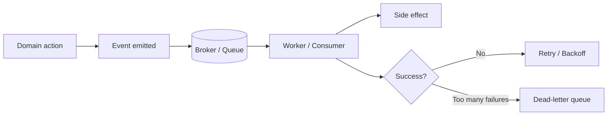

# HLD - Event Driven Jobs

> Event-driven jobs are how you make work happen **because something happened**, not because a clock ticked. It is the backbone of systems that need to react fast, stay decoupled, and keep working even when parts of the stack are flaky.

## Table of Contents

- [The Problem This Solves](#-the-problem-this-solves)
- [The Core Idea](#-the-core-idea-in-plain-english)
- [How It Actually Works](#-how-it-actually-works)
- [Let's See It In Code](#-lets-see-it-in-code)
- [Event-Driven Jobs vs Scheduled Jobs vs Inline Processing](#-event-driven-jobs-vs-scheduled-jobs-vs-inline-processing)
- [Common Mistakes & Gotchas](#-common-mistakes--gotchas)
- [When to Use It (and When Not To)](#-when-to-use-it-and-when-not-to)
- [TL;DR / Cheatsheet](#-tldr--cheatsheet)

## 🤔 The Problem This Solves

Imagine a user uploads a file.

You could:
1. Parse it immediately in the request thread.
2. Save it and have a cron job check every minute.
3. Emit an event like `file.uploaded` and let a worker pick it up.

The first option is simple but dangerous: your API gets slower, can time out, and becomes tightly coupled to the expensive work. The second option is wasteful and delayed. The third option is the sweet spot for many real systems: the request finishes quickly, and the heavy work happens asynchronously after the relevant event occurs.

This is the core pain event-driven jobs solve:

- **Decoupling**: the producer does not need to know who consumes the work.
- **Responsiveness**: user-facing requests stay fast.
- **Scalability**: workers can scale independently from the API.
- **Resilience**: retries, dead-letter queues, and buffering protect the system from temporary failure.

> [!IMPORTANT]
> Event-driven jobs are not just “background jobs with a fancy name.” The trigger matters. A scheduled job runs because time passed. An event-driven job runs because the system observed a domain event.

## 🧠 The Core Idea (in plain English)

An event-driven job is just work that gets queued or triggered when something meaningful happens in the system.

Think of it like a kitchen ticket system:
- A customer places an order.
- The cashier prints a ticket.
- The ticket goes to the right station.
- A cook handles it when ready.

The cashier does not fry the fries. The cashier just records the event and hands off the work. That separation is what makes the system scalable and clean.

In system terms:

- **Producer** emits an event.
- **Broker / queue / stream** stores or routes it.
- **Consumer / worker** processes it.
- **State store** keeps job metadata, retries, and outcomes.

<mark>The job is usually triggered by a domain event, not by a direct user action in the same request.</mark>

## 🔍 How It Actually Works

### 1) The event is created

Something happens in the domain:
- order placed
- email verified
- invoice paid
- image uploaded
- payment captured

The producer publishes an event such as:

- `order.created`
- `user.signup.completed`
- `media.thumbnail.requested`

The event should describe *what happened*, not *what to do next*.

### 2) The event enters a broker

A broker is the middle layer that stores or routes events/jobs.

Common choices:
- RabbitMQ
- Kafka
- Redis Streams
- SQS / PubSub / NATS
- an internal queue table in Postgres for smaller systems

The broker gives you buffering, fan-out, retries, ordering guarantees (sometimes), and consumer isolation.

### 3) Workers consume the event

A worker subscribes to the event type it cares about. It may:
- send an email
- generate thumbnails
- sync to a third-party API
- update a search index
- emit a follow-up event

### 4) The job succeeds, retries, or dies

Real systems fail:
- network errors
- rate limits
- invalid payloads
- downstream outages
- duplicate delivery

So you need a failure policy:
- retry with backoff
- mark poison messages
- send unrecoverable messages to a **dead-letter queue** (DLQ)
- make the job idempotent so retries are safe

### 5) Observability closes the loop

If you cannot answer “what happened to this job?”, you do not have a production system.

Track:
- job id
- event type
- retry count
- execution time
- success/failure
- last error
- correlation id / trace id

---

### Mental model



> [!NOTE]
> A good event-driven design is usually “publish now, process later.” The event is the contract. The job is the work.

## 💻 Let's See It In Code

Below is a deliberately simple version. Real production code adds auth, tracing, persistence, observability, schema validation, and proper broker integration.

### Python example: producer + worker

```python
from dataclasses import dataclass
from queue import Queue, Empty
from threading import Thread
import time
import uuid


@dataclass
class Event:
    event_id: str
    type: str
    payload: dict
    attempts: int = 0


broker = Queue()


def publish(event_type: str, payload: dict) -> None:
    event = Event(
        event_id=str(uuid.uuid4()),
        type=event_type,
        payload=payload,
    )
    broker.put(event)
    print(f"Published: {event.type} ({event.event_id})")


def handle_order_created(event: Event) -> None:
    order_id = event.payload["order_id"]
    user_email = event.payload["user_email"]
    print(f"Sending confirmation email for order {order_id} to {user_email}")
    time.sleep(1)  # pretend this is slow work


def worker() -> None:
    while True:
        try:
            event = broker.get(timeout=1)
        except Empty:
            continue

        try:
            if event.type == "order.created":
                handle_order_created(event)
            else:
                print(f"Unknown event type: {event.type}")
            print(f"Done: {event.event_id}")
        except Exception as exc:
            event.attempts += 1
            print(f"Failed {event.event_id}: {exc}")
            if event.attempts < 3:
                print("Retrying...")
                broker.put(event)
            else:
                print(f"Sending {event.event_id} to DLQ")
        finally:
            broker.task_done()


Thread(target=worker, daemon=True).start()

publish("order.created", {
    "order_id": "ORD-1001",
    "user_email": "arindal@example.com"
})

broker.join()
```

### C++ example: event queue + consumer loop

```cpp
#include <iostream>
#include <queue>
#include <string>
#include <unordered_map>
#include <functional>
#include <thread>
#include <chrono>
#include <mutex>
#include <condition_variable>

struct Event {
    std::string id;
    std::string type;
    std::unordered_map<std::string, std::string> payload;
    int attempts = 0;
};

class EventQueue {
public:
    void push(const Event& event) {
        {
            std::lock_guard<std::mutex> lock(mutex_);
            q_.push(event);
        }
        cv_.notify_one();
    }

    Event pop() {
        std::unique_lock<std::mutex> lock(mutex_);
        cv_.wait(lock, [&] { return !q_.empty(); });
        Event event = q_.front();
        q_.pop();
        return event;
    }

private:
    std::queue<Event> q_;
    std::mutex mutex_;
    std::condition_variable cv_;
};

void handleOrderCreated(const Event& event) {
    auto it = event.payload.find("order_id");
    if (it == event.payload.end()) {
        throw std::runtime_error("Missing order_id");
    }

    std::cout << "Generating invoice for order " << it->second << std::endl;
    std::this_thread::sleep_for(std::chrono::seconds(1));
}

int main() {
    EventQueue broker;

    std::thread worker([&]() {
        while (true) {
            Event event = broker.pop();

            try {
                if (event.type == "order.created") {
                    handleOrderCreated(event);
                } else {
                    std::cout << "Unknown event type: " << event.type << std::endl;
                }
                std::cout << "Processed event: " << event.id << std::endl;
            } catch (const std::exception& e) {
                std::cout << "Failed event " << event.id << ": " << e.what() << std::endl;
                if (event.attempts < 3) {
                    Event retry = event;
                    retry.attempts++;
                    broker.push(retry);
                } else {
                    std::cout << "Moving event to DLQ: " << event.id << std::endl;
                }
            }
        }
    });

    broker.push(Event{
        "evt-1",
        "order.created",
        {{"order_id", "ORD-1001"}, {"user_email", "arindal@example.com"}},
        0
    });

    worker.join();
    return 0;
}
```

> [!WARNING]
> The code above is intentionally simplified. In real life, a queue is not just an in-memory `std::queue` or Python `Queue` - it is a durable broker with persistence, visibility timeouts, acknowledgements, and failure semantics.

## ⚖️ Event-Driven Jobs vs Scheduled Jobs vs Inline Processing

| Aspect | Event-Driven Jobs | Scheduled Jobs | Inline Processing |
|---|---|---|---|
| Trigger | A domain event happened | Time-based schedule | User request path |
| Latency | Near real-time | Delayed until next run | Immediate, but blocks request |
| Coupling | Low | Medium | High |
| Scalability | Strong | Good for batch | Weak for heavy work |
| Failure handling | Retries, DLQ, replay | Retry at next window | Request failure impacts user |
| Best for | Reactive workflows | Cleanup, reports, periodic sync | Cheap, fast operations |

### Rule of thumb

- Use **event-driven jobs** when the work naturally follows a state change.
- Use **scheduled jobs** when time itself is the trigger.
- Use **inline processing** when the task is tiny and must succeed before the request can finish.

## ⚠️ Common Mistakes & Gotchas

### 1) Doing too much in the event handler

A handler should not become a second monolith. Keep it focused.

Bad smell:
- fetch user
- validate payment
- call email service
- create audit log
- update analytics
- rebuild search index
- send Slack notification

That is six jobs pretending to be one.

### 2) Forgetting idempotency

Event delivery is often **at least once**. That means the same event can be processed more than once.

Your job must tolerate duplicates.

Example:
- do not charge a card twice
- do not create duplicate invoices
- do not send the same email twice unless you really mean to

### 3) Ignoring backpressure

If producers outrun consumers, the queue grows forever. That is not “async magic”; that is a memory, cost, and latency problem.

### 4) No dead-letter strategy

When a message cannot be processed after retries, do not keep hammering it forever. Send it to a DLQ with enough context to debug later.

### 5) Loose event contracts

If producers emit shape-shifting payloads, consumers break silently.

Version your event schema.

### 6) Not tracking job identity

Without event IDs, correlation IDs, and job status, debugging becomes archaeology.

## ✅ When to Use It (and When Not To)

Use event-driven jobs when:
- a domain event naturally starts a workflow
- you want to decouple systems
- you need scale on the async side
- you care about retries and resilience
- the work can happen after the user-facing request returns

Do **not** use it when:
- the task is tiny and must complete synchronously
- the work is a one-off admin task with no event source
- you need strict transactional completion across multiple systems and have not thought through consistency
- the team cannot operate a queue, worker fleet, and monitoring stack yet

> [!IMPORTANT]
> Event-driven architecture is powerful, but it raises operational complexity. If the team is not ready to own brokers, retries, schemas, observability, and replay semantics, the design will hurt more than it helps.

## 📝 TL;DR / Cheatsheet

- **Event-driven job** = work triggered by a meaningful event.
- Producer emits an event, broker stores/routes it, worker processes it.
- Main wins: decoupling, responsiveness, scalability, resilience.
- Main risks: duplicates, retries, DLQs, schema drift, backpressure.
- Best practice: keep handlers small, make them idempotent, version the event contract, and instrument everything.

### Quick decision table

| Question | If yes | If no |
|---|---|---|
| Does a real domain event start the work? | Event-driven job | Consider scheduled or inline |
| Can it run after the request returns? | Async is fine | Keep it synchronous |
| Can retries happen safely? | Great candidate | Design idempotency first |
| Do you need worker scaling independent of API traffic? | Good fit | Simpler model may be enough |

## 🔗 Further Reading

- Event streaming and queue semantics
- Idempotency patterns
- Dead-letter queues
- Outbox pattern
- Saga pattern
- Backoff and retry strategies
