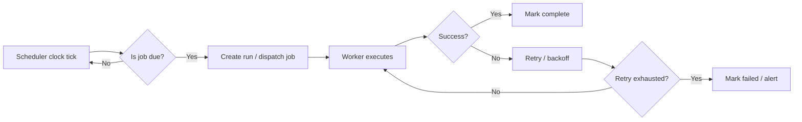

# HLD - Schedule Driven Jobs

> Schedule-driven jobs are the boring-but-essential machinery that makes systems do something **at a specific time**, whether that is every minute, every night, or the first Monday of the month. They are what you use when time is the trigger, not an event in the domain.

## Table of Contents

- [The Problem This Solves](#-the-problem-this-solves)
- [The Core Idea](#-the-core-idea-in-plain-english)
- [How It Actually Works](#-how-it-actually-works)
- [Let's See It In Code](#-lets-see-it-in-code)
- [Schedule-Driven Jobs vs Event-Driven Jobs vs Inline Processing](#-schedule-driven-jobs-vs-event-driven-jobs-vs-inline-processing)
- [Common Mistakes & Gotchas](#-common-mistakes--gotchas)
- [When to Use It (and When Not To)](#-when-to-use-it-and-when-not-to)
- [TL;DR / Cheatsheet](#-tldr--cheatsheet)

## 🤔 The Problem This Solves

Some work does not naturally start because a user clicked a button or a record changed.

Instead, it has to happen:
- every day at 2 AM
- every 15 minutes
- every Sunday night
- on the first day of the month
- at a fixed time in a specific timezone

That is where schedule-driven jobs come in.

You use them for jobs like:
- sending daily digests
- generating invoices
- cleaning up expired sessions
- syncing reports to a partner system
- rebuilding search indexes
- rotating logs
- checking for stale records
- sending reminders

If you do this inline, the user request becomes slow and fragile. If you do it manually, it will eventually be forgotten. If you do it with a scheduler, the system just keeps showing up on time.

> [!IMPORTANT]
> Schedule-driven jobs are triggered by **time**. That is the defining trait. The work starts because a schedule says so, not because a domain event happened.

## 🧠 The Core Idea (in plain English)

A schedule-driven job is just a worker or task runner that wakes up at pre-defined times and does the assigned work.

Think of it like a janitor with a checklist:
- every morning, empty the trash
- every evening, lock the doors
- every Friday, deep clean the lobby

Nobody calls the janitor each time. The schedule is the contract.

In system terms:
- a **scheduler** decides *when* something should run
- a **job definition** says *what* should run
- a **worker** performs the job
- a **store** keeps job state, last-run time, retries, and history

<mark>The schedule is the trigger. The job is the work.</mark>

## 🔍 How It Actually Works

### 1) A schedule is defined

A schedule is usually expressed as:
- cron expression: `0 2 * * *`
- interval: every 5 minutes
- calendar rule: every weekday at 9 AM
- timezone-aware schedule: 9 AM IST, not just 9 AM server time

### 2) A scheduler evaluates time

A scheduler is the component that wakes up and asks:
- Is it time to run this job?
- Has it already run for this slot?
- Did the previous attempt succeed?
- Should I retry it?
- Am I within the allowed window?

### 3) The job is dispatched

The scheduler either:
- runs the job directly in the same process, or
- enqueues it to a queue, or
- hands it to a worker fleet

For serious systems, the last option is usually safest. The scheduler should be small and reliable. The actual work should happen somewhere else.

### 4) The worker executes the task

The worker performs the action:
- query database
- build report
- send emails
- sync third-party data
- expire tokens
- clean up temp files

### 5) Failures are handled deliberately

Scheduled jobs fail in boring ways:
- the app was down at the run time
- the task exceeded its time limit
- the downstream API returned 429
- two schedulers fired the same job
- a timezone shifted due to DST
- the job took longer than its interval

So you need:
- retries with backoff
- locking / leader election
- idempotency
- run tracking
- missed-run policy
- dead-letter handling if the job is queued

### Mental model



> [!NOTE]
> A schedule-driven system is less about “running code later” and more about “making sure it runs exactly once, or at least once, at the right time, without waking you up at 3 AM.”

## 💻 Let's See It In Code

Below is a simple in-memory version. Real production systems need persistence, distributed locks, observability, and crash recovery.

### Python example: scheduler loop

```python
import time
from datetime import datetime, timedelta, timezone


def daily_report_job():
    print(f"[{datetime.now(timezone.utc)}] Generating daily report...")


def should_run(now: datetime, last_run: datetime | None) -> bool:
    if last_run is None:
        return True
    return now - last_run >= timedelta(seconds=10)  # demo interval


def scheduler():
    last_run = None

    while True:
        now = datetime.now(timezone.utc)

        if should_run(now, last_run):
            try:
                daily_report_job()
                last_run = now
                print("Job completed")
            except Exception as exc:
                print(f"Job failed: {exc}")
                # In real systems: retry, alert, store failure state

        time.sleep(1)


if __name__ == "__main__":
    scheduler()
```

### C++ example: periodic task runner

```cpp
#include <chrono>
#include <iostream>
#include <thread>
#include <functional>
#include <stdexcept>

void dailyReportJob() {
    std::cout << "Generating daily report..." << std::endl;
    std::this_thread::sleep_for(std::chrono::seconds(1));
}

int main() {
    using clock = std::chrono::steady_clock;
    auto lastRun = clock::now() - std::chrono::seconds(10);

    while (true) {
        auto now = clock::now();

        if (now - lastRun >= std::chrono::seconds(10)) { // demo interval
            try {
                dailyReportJob();
                lastRun = now;
                std::cout << "Job completed\n";
            } catch (const std::exception& e) {
                std::cout << "Job failed: " << e.what() << "\n";
                // In production: retry, persist failure, alert ops
            }
        }

        std::this_thread::sleep_for(std::chrono::seconds(1));
    }

    return 0;
}
```

> [!WARNING]
> In-memory scheduling is fine for learning. It is not enough for production because the process can crash, restart, or scale horizontally and create duplicate runs.

## ⚖️ Schedule-Driven Jobs vs Event-Driven Jobs vs Inline Processing

| Aspect | Schedule-Driven Jobs | Event-Driven Jobs | Inline Processing |
|---|---|---|---|
| Trigger | Time-based | Domain event-based | User request path |
| Typical examples | nightly reports, cleanup, reminders | send email after signup, thumbnail generation after upload | validation, quick DB writes |
| Latency | Defined by schedule | Near real-time | Immediate |
| Coupling | Low | Low | High |
| Risk | Missed runs, duplicates, timezone issues | duplicate delivery, event ordering | slow requests, timeouts |
| Best for | periodic or calendar-based work | reactive workflows | tiny must-complete-now tasks |

### Rule of thumb

- Use **schedule-driven jobs** when time is the business signal.
- Use **event-driven jobs** when a domain state change is the signal.
- Use **inline processing** when the work is short and must finish before the user gets a response.

## ⚠️ Common Mistakes & Gotchas

### 1) Using the app server as the scheduler

That works until you deploy multiple replicas. Then every replica thinks it owns the clock, and the same job runs multiple times.

### 2) Ignoring timezone and DST

This is a classic footgun.

“Run every day at 2:30 AM” sounds simple until daylight saving time makes that time disappear or happen twice.

### 3) Not making jobs idempotent

A schedule can be retried. A deployment can restart halfway through. A lock can fail. Your job must tolerate duplicates.

Example:
- do not send the same invoice twice
- do not clean the same file twice if that causes errors
- do not create duplicate monthly records

### 4) No lock or leader election

If multiple workers can run the same schedule, you need a way to make one of them the owner.

Options:
- distributed lock
- leader election
- lease-based ownership
- database row claiming

### 5) No missed-run policy

What should happen if the system was offline during the scheduled time?
- skip it
- run it immediately
- run only the latest missed occurrence
- backfill all missed runs

You need an explicit policy, not accidental behavior.

### 6) No visibility into failures

If a nightly job silently fails for three days, that is a production incident waiting to happen.

Track:
- scheduled time
- actual start time
- actual finish time
- duration
- result
- error message
- retry count

## ✅ When to Use It (and When Not To)

Use schedule-driven jobs when:
- the business rule is time-based
- the task repeats on a calendar or interval
- you need regular cleanup or reconciliation
- you need reports, reminders, billing, syncing, or maintenance
- a delay is acceptable and expected

Do **not** use them when:
- the work should happen immediately after a state change
- the trigger is a real domain event
- the task is tiny enough to stay inline
- you cannot define a reliable schedule or missed-run policy
- the team cannot operate distributed schedulers safely yet

> [!IMPORTANT]
> The hardest part is not “how do I run code every day?” The hard part is “how do I guarantee correctness when processes crash, clocks drift, schedules overlap, and jobs retry?”

## 📝 TL;DR / Cheatsheet

- **Schedule-driven job** = work triggered by **time**, not by an event.
- Main components: scheduler, job definition, worker, storage.
- Best for periodic tasks: reports, cleanup, reminders, syncs, billing.
- Production concerns: timezone, DST, locking, retries, idempotency, missed runs.
- In-memory loops are demos only; production needs persistence and coordination.

### Quick decision table

| Question | If yes | If no |
|---|---|---|
| Is the trigger time-based? | Schedule-driven job | Consider event-driven or inline |
| Can duplicates happen safely? | Good fit | Make it idempotent first |
| Are multiple replicas possible? | Need locks / leader election | Simpler |
| Can missed runs be defined clearly? | Safe to schedule | Revisit the design |

## 🔗 Further Reading

- Cron semantics
- Distributed locks
- Leader election
- Idempotency
- Retry policies and backoff
- Timezone handling and DST
- Outbox pattern for reliable triggering
