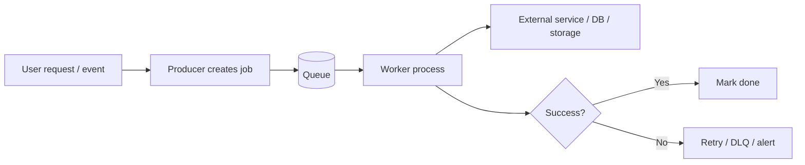
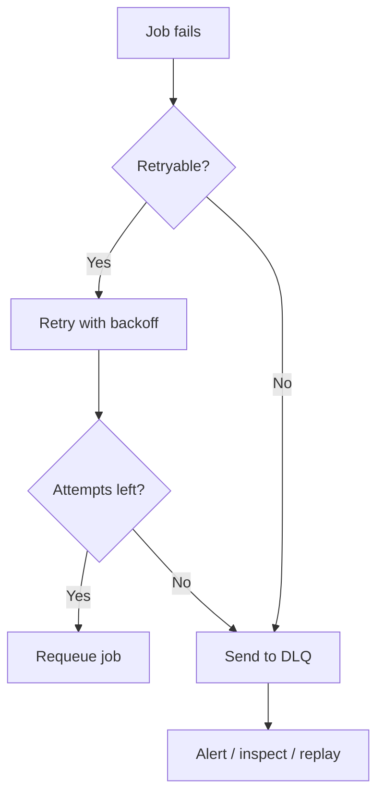

# HLD - Background Jobs

> Background jobs are the stuff you **do not want blocking the user’s request**: sending emails, generating reports, resizing images, syncing data, running cleanup, and anything else that can happen *later* without breaking the product.
> The hard part is not “running code in the background.” The hard part is making it **reliable, observable, retryable, and safe to run twice**.

## Table of Contents
- [🤔 The Problem This Solves](#-the-problem-this-solves)
- [🧠 The Core Idea](#-the-core-idea-in-plain-english)
- [🔍 How It Actually Works](#-how-it-actually-works)
- [💻 Let's See It In Code](#-lets-see-it-in-code)
- [⚖️ Background Jobs vs Related Patterns](#-background-jobs-vs-related-patterns)
- [⚠️ Common Mistakes & Gotchas](#-common-mistakes--gotchas)
- [✅ When to Use It (and When Not To](#-when-to-use-it-and-when-not-to)
- [📝 TL;DR / Cheatsheet](#-tldr--cheatsheet)

## 🤔 The Problem This Solves

A web request has a limited patience budget.

If a user clicks **“Sign up”**, they expect the page to return quickly. But the system may also need to:

- create user records
- send a welcome email
- create analytics events
- provision resources
- update search indexes
- notify downstream services

If you do all of that inline, the request becomes slow, fragile, and expensive to scale.

Background jobs exist to move work **off the request path** and into a separate execution lane. That gives you:

- faster user-facing APIs
- better failure isolation
- controlled throughput
- retries without making users wait
- the ability to run heavy or delayed work asynchronously

> [!IMPORTANT]
> A background job is not just “a thread in the app.” In HLD terms, it is usually a **separate processing model** with a queue, worker fleet, retry policy, and observability around it.

## 🧠 The Core Idea (in plain English)

Think of background jobs like a restaurant kitchen ticket system.

The waiter does **not** cook your food at the table. They take the order, drop a ticket, and the kitchen processes it separately. The user gets a fast response, and the kitchen can batch, retry, and prioritize work without blocking the dining room.

That is the same idea here:

**Request path** = fast, user-facing, low-latency  
**Background path** = slow, durable, retryable, eventually consistent

The core design question is always:

> “What can happen later without hurting the user experience or correctness?”

If the answer is “yes,” push it into a background job.

## 🔍 How It Actually Works

### 1) Producer → Queue → Worker

The basic pattern has three parts:

- **Producer**: the app that creates the job
- **Queue**: durable buffer that stores jobs temporarily
- **Worker**: a process that pulls jobs and executes them



The queue is the shock absorber. It lets the producer and worker run at different speeds.

### 2) Why a queue matters

Without a queue, your app has to be up *and* ready *and* fast *and* stable at the exact moment work arrives.

With a queue:

- spikes get buffered
- workers can autoscale separately
- slow downstream systems do not directly freeze requests
- retries are centralized

### 3) The worker contract

A worker should usually do four things well:

1. claim a job
2. execute the task
3. record success or failure
4. retry safely if needed

> [!TIP]
> A good background-job design assumes every job may run **zero, one, or more than one time**. That sounds annoying, but it is the reality of distributed systems.

### 4) Delivery semantics

The two common models are:

- **At-most-once**: job is processed zero or one time
- **At-least-once**: job is processed one or more times

Most real systems choose **at-least-once** because it is easier to recover from failures.  
That means the job handler must be **idempotent** (same effect even if repeated).

### 5) Retry and dead-letter queues

Retries are not optional. Systems fail.

Typical flow:

- transient failure → retry with backoff
- repeated failure → send to DLQ (dead-letter queue)
- DLQ → inspect manually or replay later



### 6) What kinds of jobs exist?

In practice, background jobs usually fall into these buckets:

| Job Type | Examples | Key Property |
|---|---|---|
| **Immediate async** | send welcome email, invalidate cache | low latency, user-triggered |
| **Scheduled** | nightly reports, cleanup, reminders | time-based execution |
| **Batch** | export 1M rows, rebuild search index | high throughput |
| **Event-driven** | process webhook, update projections | reacts to upstream events |
| **Long-running** | video transcoding, PDF generation | heavy CPU / IO |

## 💻 Let's See It In Code

### Python: enqueue + worker with retry and idempotency

```python
from dataclasses import dataclass
from typing import Set
import time
import random

@dataclass(frozen=True)
class Job:
    id: str
    type: str
    payload: dict
    attempts: int = 0

processed_jobs: Set[str] = set()   # replace with durable store in real systems
queue: list[Job] = []

def enqueue(job: Job) -> None:
    queue.append(job)

def send_welcome_email(user_id: str, email: str) -> None:
    # fake flaky dependency
    if random.random() < 0.3:
        raise RuntimeError("SMTP timeout")
    print(f"Sent welcome email to {email} for user={user_id}")

def handle_job(job: Job) -> None:
    # idempotency guard
    if job.id in processed_jobs:
        print(f"Skipping duplicate job {job.id}")
        return

    if job.type == "send_welcome_email":
        send_welcome_email(job.payload["user_id"], job.payload["email"])
    else:
        raise ValueError(f"Unknown job type: {job.type}")

    processed_jobs.add(job.id)

def worker_loop(max_attempts: int = 5) -> None:
    while queue:
        job = queue.pop(0)
        try:
            handle_job(job)
            print(f"Job {job.id} done")
        except Exception as e:
            print(f"Job {job.id} failed: {e}")

            if job.attempts + 1 < max_attempts:
                backoff_seconds = 2 ** job.attempts
                time.sleep(0.1)  # keep demo short; real backoff would be longer
                enqueue(Job(
                    id=job.id,
                    type=job.type,
                    payload=job.payload,
                    attempts=job.attempts + 1
                ))
                print(f"Requeued {job.id} after backoff {backoff_seconds}s")
            else:
                print(f"Job {job.id} moved to DLQ")

enqueue(Job(
    id="job_101",
    type="send_welcome_email",
    payload={"user_id": "u_1", "email": "a@example.com"}
))

worker_loop()
```

### C++: worker loop with basic retry shape

```cpp
#include <iostream>
#include <queue>
#include <string>
#include <unordered_set>
#include <stdexcept>

struct Job {
    std::string id;
    std::string type;
    std::string payload;
    int attempts = 0;
};

std::queue<Job> jobQueue;
std::unordered_set<std::string> processed;

void enqueue(const Job& job) {
    jobQueue.push(job);
}

void doWork(const Job& job) {
    // Simulated failure
    if (job.attempts < 2) {
        throw std::runtime_error("Transient upstream failure");
    }
    std::cout << "Processed job: " << job.id << "
";
}

void workerLoop(int maxAttempts = 5) {
    while (!jobQueue.empty()) {
        Job job = jobQueue.front();
        jobQueue.pop();

        if (processed.count(job.id)) {
            std::cout << "Skipping duplicate job: " << job.id << "
";
            continue;
        }

        try {
            doWork(job);
            processed.insert(job.id);
        } catch (const std::exception& e) {
            std::cout << "Job failed: " << job.id << " reason=" << e.what() << "
";

            if (job.attempts + 1 < maxAttempts) {
                job.attempts++;
                enqueue(job); // retry
            } else {
                std::cout << "Moved to DLQ: " << job.id << "
";
            }
        }
    }
}

int main() {
    enqueue({"job_201", "resize_image", "image_abc.png", 0});
    workerLoop();
}
```

> [!NOTE]
> The code above is intentionally simple. Real systems persist jobs in a durable queue, persist job state, use locking/leases, and record attempt history in storage.

## ⚖️ Background Jobs vs Related Patterns

| Pattern | Best For | Pros | Trade-offs |
|---|---|---|---|
| **Synchronous request** | instant response needed | simple, immediate feedback | slow if work is heavy |
| **Background job** | work can happen later | fast UX, retries, isolation | eventual consistency, more moving parts |
| **Cron / scheduler** | time-based tasks | predictable, easy to reason about | not event-driven |
| **Event streaming** | many consumers, event propagation | decoupled, replayable | harder operationally |
| **Batch processing** | large offline datasets | efficient for bulk work | not real-time |

### The useful mental split

- Use a **background job** when work is triggered by a request or event and should run soon.
- Use **cron** when time itself is the trigger.
- Use **streams** when many systems need to react to the same event.
- Use **batch** when throughput matters more than latency.

## ⚠️ Common Mistakes & Gotchas

> [!WARNING]
> **Non-idempotent jobs** are the fastest way to create duplicate emails, duplicate charges, duplicate notifications, and duplicate side effects.

### 1) Assuming “queued” means “done”
Enqueueing is not success. It only means the job was accepted.

### 2) Ignoring duplicates
A job can be retried after the worker crashed *after* doing the work but *before* acking completion.

### 3) Putting too much logic in the handler
Handlers should orchestrate, not become mini-monoliths.

### 4) No visibility
If you cannot answer these quickly, your design is weak:

- how many jobs are pending?
- how old is the oldest job?
- what is failing?
- how many retries are happening?
- what is in the DLQ?

### 5) No backpressure
If producers can enqueue faster than workers can consume, queue depth grows forever.

### 6) Treating every job as equally urgent
You usually need priorities:
- high: user-facing notifications
- medium: enrichment
- low: reports / cleanup

### 7) Tight coupling to one worker implementation
Prefer a job contract that can survive worker changes.

## ✅ When to Use It (and When Not To)

### Use background jobs when:
- the task is slow
- the task can be retried
- the task can be eventually consistent
- the task involves flaky dependencies
- user experience improves if you return early

### Do not use background jobs when:
- the user needs the result immediately
- failure must block the request
- the operation is tiny and deterministic
- the system would become more complex than the problem deserves

> [!IMPORTANT]
> If the user cannot safely continue without the result, backgrounding it may just hide the problem instead of solving it.

## 📝 TL;DR / Cheatsheet

- **Background job** = async work moved off the request path
- Main pieces: **producer → queue → worker**
- Most systems prefer **at-least-once delivery**
- That means handlers must be **idempotent**
- Retries need **backoff**, a **max attempt count**, and usually a **DLQ**
- Background jobs are great for slow, flaky, or non-urgent work
- They are a bad fit when the user needs the answer right now

### One-line architecture summary

**Client/request → API → enqueue job → worker consumes → external service / DB → success, retry, or DLQ**

## 🔗 Further Reading

- Queue semantics: at-most-once vs at-least-once delivery
- Idempotency in distributed systems
- Dead-letter queues and retry backoff
- Worker leases / visibility timeout
- Outbox pattern for reliable event publishing
