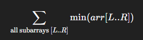

# 📊 Sum of Subarray Minimums [#907](https://leetcode.com/problems/sum-of-subarray-minimums/)

> Goal: For an array `arr`, compute

> 

> Return the sum modulo **1,000,000,007**.


---

## 🧠 Problem Statement

**Input:** `vector<int> arr` <br>
**Output:** Sum of minimums of all contiguous subarrays of `arr` (mod `1e9+7`).

**Example**
`arr = [3,1,2,4]`
All subarrays & minimums:

* `[3]→3`, `[3,1]→1`, `[3,1,2]→1`, `[3,1,2,4]→1`
* `[1]→1`, `[1,2]→1`, `[1,2,4]→1`
* `[2]→2`, `[2,4]→2`
* `[4]→4`

Sum = `3 + 1 + 1 + 1 + 1 + 1 + 1 + 2 + 2 + 4 = 17`.

---

### 🧩 Intuition (Contribution Method)

Each element `arr[i]` becomes the **minimum** for some set of subarrays that **extend left** and **right** from `i` until we hit a **smaller** (or **smaller-or-equal**) element that would disqualify it as the min.

If we can count:

* `left =` how many choices for the **left boundary** where `arr[i]` stays the minimum,
* `right =` how many choices for the **right boundary** where `arr[i]` stays the minimum,

then the number of subarrays where `arr[i]` is the minimum is `left * right`, and its **total contribution** is:

```
arr[i] * left * right
```

Summing over all `i` gives the answer.

---

### 🐢 Brute Force (why it’s bad)

Enumerate all subarrays → `O(n^2)` subarrays, then scan each to find a min → `O(n)` per subarray.
**Time:** `O(n^3)` naive, or `O(n^2)` with running minima tricks — still too slow for large `n` (e.g., 1e5).


### ⚡ Optimal Approach — Monotonic Stacks (O(n))

We compute for each index `i`:

* `PSE[i]`: index of the **Previous Strictly Smaller** element to the left of `i` (or `-1` if none)
* `NSE[i]`: index of the **Next Smaller or Equal** element to the right of `i` (or `n` if none)

Then:

```
left  = i - PSE[i]
right = NSE[i] - i
contribution(i) = arr[i] * left * right
```

> 🔑 **Tie-breaking to avoid double counting**:
> Use **strictly smaller** on one side and **smaller-or-equal** on the other side.
> We will use:
>
> * **Prev Smaller** with `>=` in the pop: ensures `PSE` is **strictly smaller**
> * **Next Smaller** with `>` in the pop: ensures `NSE` is **smaller-or-equal**

This combination ensures **equal values** are attributed consistently to **the rightmost one in a block on the left side** (or symmetrically, depending on which side you choose ≤ on).


### 🧪 Dry Run (tie example)

`arr = [2, 2, 2]` (all equal)

* `PSE` (prev strictly smaller): `[-1, -1, -1]`
* `NSE` (next smaller-or-equal): `[1, 2, 3]`

Contributions:

* `i=0`: left=`1`, right=`1`, contrib=`2*1*1=2`
* `i=1`: left=`2`, right=`1`, contrib=`2*2*1=4`
* `i=2`: left=`3`, right=`1`, contrib=`2*3*1=6` → total `12`

Check manually:
All subarrays:

* `[2] [2] [2]` → `2+2+2`
* `[2,2] [2,2]` → `2+2`
* `[2,2,2]`      → `2`
  Total `2+2+2+2+2+2 = 12`. ✅


### ✅ Full, Polished Code

```cpp
#include <bits/stdc++.h>
using namespace std;

static const int MOD = 1'000'000'007;

// Next Smaller-or-Equal to the Right (NSE): first j > i with arr[j] <= arr[i]; if none, n
vector<int> nextSmallerOrEqualRight(const vector<int>& arr) {
    int n = (int)arr.size();
    vector<int> nse(n, n);
    stack<int> st; // increasing by value (indices)
    for (int i = n - 1; i >= 0; --i) {
        while (!st.empty() && arr[st.top()] > arr[i]) st.pop(); // '>' → keep equal to stop here
        nse[i] = st.empty() ? n : st.top();
        st.push(i);
    }
    return nse;
}

// Previous Strictly Smaller to the Left (PSE): last j < i with arr[j] < arr[i]; if none, -1
vector<int> prevStrictlySmallerLeft(const vector<int>& arr) {
    int n = (int)arr.size();
    vector<int> pse(n, -1);
    stack<int> st; // increasing by value (indices)
    for (int i = 0; i < n; ++i) {
        while (!st.empty() && arr[st.top()] >= arr[i]) st.pop(); // '>=' → ensure strictly smaller remains
        pse[i] = st.empty() ? -1 : st.top();
        st.push(i);
    }
    return pse;
}

int sumSubarrayMins(vector<int>& arr) {
    int n = (int)arr.size();
    if (n == 0) return 0;

    vector<int> nse = nextSmallerOrEqualRight(arr);
    vector<int> pse = prevStrictlySmallerLeft(arr);

    long long tot = 0;
    for (int i = 0; i < n; ++i) {
        long long left  = i - pse[i];
        long long right = nse[i] - i;
        long long contrib = (left % MOD) * (right % MOD) % MOD;
        contrib = (contrib * (arr[i] % MOD)) % MOD;

        // Keep tot in [0, MOD) — adding two numbers < MOD => result < 2*MOD; one subtraction suffices
        tot += contrib;
        if (tot >= MOD) tot -= MOD;
    }
    return (int)tot;
}

// --- Optional: quick harness ---
int main() {
    ios::sync_with_stdio(false);
    cin.tie(nullptr);

    // Example: 3 1 2 4
    vector<int> arr;
    for (int x; cin >> x; ) arr.push_back(x);
    cout << sumSubarrayMins(arr) << "\n";
    return 0;
}
```

#### ✅ Why the modulo addition is correct here

* We ensure `contrib < MOD`.
* We maintain `tot < MOD` after each iteration by subtracting `MOD` **at most once**.
  Since `tot_before < MOD` and `contrib < MOD`, `tot_before + contrib < 2*MOD`. One subtraction is enough.
  (Equivalently, you may use `tot = (tot + contrib) % MOD` if you prefer.)


### ⏱️ Complexity

* **Time:** `O(n)` — each index is pushed and popped at most once in each stack pass.
* **Space:** `O(n)` — for the stacks and the `pse` / `nse` arrays.


### 🧪 Test Cases

1. **Basic**

   * `arr = [3,1,2,4]` → `17`

2. **Single element**

   * `arr = [5]` → `5`

3. **All increasing**

   * `arr = [1,2,3,4]`
     Every subarray’s min is the leftmost; answer = `1*4 + 2*3 + 3*2 + 4*1 = 20`

4. **All decreasing**

   * `arr = [4,3,2,1]`
     Every subarray’s min is the rightmost; answer = `4*1 + 3*2 + 2*3 + 1*4 = 20`

5. **With duplicates**

   * `arr = [2,2,2]` → `12` (as shown above)

6. **Large values**

   * `arr = [100000, 100000]` →
     Subarrays: `[100000]`, `[100000]`, `[100000,100000]` → `100000 + 100000 + 100000 = 300000 (mod)`.


### 🧠 Tips, Tricks, and Gotchas

* **Duplicates:** The **tie-breaking** is crucial. Use one side with `strict` (`<`) and the other with `non-strict` (`<=`) comparison to avoid double counting.

  * In code:

    * **Prev** uses `>=` pop → prev **strictly smaller**
    * **Next** uses `>` pop → next **smaller or equal**

* **Overflow:** Use `long long` for `left * right * arr[i]`. Apply `% MOD` at each step.

* **Symmetry:** You can swap the roles: use

  * `Prev <=` and `Next <` instead.
    Just be consistent.

* **Index stacks:** We store **indices** on stacks (not values) so we can compute distances (`i - pse[i]`, `nse[i] - i`) and handle duplicates correctly.


### 🔁 Variations

* **Sum of Subarray Maximums**: Same pattern but flip the comparisons:

  * Use **prev strictly greater** and **next greater-or-equal**, or the symmetric tie-breaking.
* **Count of subarrays where `arr[i]` is the min/max**: Return `left * right` for each `i`.
* **Product/Sum with other functions**: Replace `arr[i]` with any weight if you’re counting with different contributions.


### ❓ FAQs

**Q1: Why `>` on the right and `>=` on the left (and not the other way)?**
> Either convention works as long as **one side is strict and the other is non-strict**. This prevents double counting when equal values appear consecutively. We picked `PSE` strict / `NSE` non-strict, which is common.

**Q2: Can I just use both strict or both non-strict?**
> No. With duplicates, that double counts or misses contributions. Always mix strictness.

**Q3: Why stacks of indices, not values?**
> We need distances and to handle duplicates precisely. Indices make that easy.

**Q4: Is the modulo accumulation correct without `%` each time?**
> Yes, because we ensure `tot` is kept in `[0, MOD)` after each step and `contrib < MOD`.

