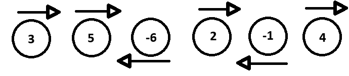

# ☄️ Asteroid Collision [#735](https://leetcode.com/problems/asteroid-collision/description/)

## 🧩 Problem Statement

* `arr[i] > 0` → asteroid of size `arr[i]` moving **right**
* `arr[i] < 0` → asteroid of size `|arr[i]|` moving **left**
* When a **right-moving** asteroid meets a **left-moving** asteroid, they collide:

  * Smaller one explodes.
  * If equal size, both explode.
  * Asteroids moving in the **same direction** never meet.

**Return** the state of asteroids after all collisions.

> **Input:** [3,5,-6,2,-1,4]​​​​​​​



> **Output:** [-6, 2, 4]

---

### 💡 Intuition (Why a Stack?)

Only **adjacent** asteroids with **opposite directions** can collide, and collisions occur **in order** as we sweep left→right.
A stack (or `vector` used as one) naturally models “the sky so far”:

* Push **right-movers**.
* When a **left-mover** arrives, it may collide with the **top** right-mover(s) until:

  * The left-mover explodes (bigger right on top), or
  * It survives (stack empty or top is a left-mover), or
  * They both explode (equal size).

This is a **monotonic** process (no backtracking needed beyond the stack tops).


### 🐢 Brute Force (why it’s bad)

Simulate pairwise collisions, repeatedly scanning the array and merging neighbors:

* Potentially **O(n²)** because each pass might remove one pair only.


### ⚡ Optimal Approach (Stack) — O(n)

Process each asteroid once:

1. If current is **right-moving** (`> 0`), push it.
2. If current is **left-moving** (`< 0`):

   * While stack top is a **right-mover** and **smaller** than current (`abs(curr) > top`), pop the top (it explodes).
   * If top is **equal size**, pop top and **do not** push current (both explode).
   * If stack is empty or top is **left-mover**, push current (it survives).

This guarantees each asteroid is pushed/popped at most once → **O(n)** time.


### ✨ Clean, Commented Code

```cpp
#include <bits/stdc++.h>
using namespace std;

// O(n) time, O(n) space
vector<int> asteroidCollision(const vector<int>& arr) {
    vector<int> st; // use as stack

    for (int a : arr) {
        if (a > 0) {
            // Right-moving asteroid never collides immediately; push it
            st.push_back(a);
        } else {
            // a is moving left; may collide with right-movers on top
            bool alive = true;
            while (alive && !st.empty() && st.back() > 0 && st.back() < -a) {
                st.pop_back(); // smaller right-mover explodes
            }

            if (!st.empty() && st.back() > 0) {
                if (st.back() == -a) {
                    // equal sizes: both explode
                    st.pop_back();
                }
                // if st.back() > -a, current left-mover dies; do not push
                // if st.back() < -a we already popped and continue above
            } else {
                // stack empty or top is left-moving -> current survives
                st.push_back(a);
            }
        }
    }
    return st;
}

int main() {
    ios::sync_with_stdio(false);
    cin.tie(nullptr);

    vector<int> v;
    for (int x; cin >> x; ) v.push_back(x);

    auto res = asteroidCollision(v);
    for (int x : res) cout << x << ' ';
    return 0;
}
```

* Uses `vector<int> ans` as a **stack**.
* Correctly pops all smaller right-movers when a left-mover arrives.
* Handles **equal-size** explosion.
* Pushes the left-mover only if it survives.

### ⏱️ Complexity

* **Time:** `O(n)` — each asteroid is pushed/popped at most once.
* **Space:** `O(n)` worst case (no collisions).

---

### 🧪 Test Cases

1. **Basic collisions**

```
arr = [5, 10, -5]      → [5, 10]
Explanation: 10 vs -5 → -5 dies; 5 unaffected
```

2. **Equal sizes**

```
arr = [8, -8]          → []
Explanation: both explode
```

3. **Cascade pops**

```
arr = [10, 2, -5]      → [10]
Explanation: 2 vs -5 → -5 survives; 10 vs -5 → -5 dies
```

4. **No collisions**

```
arr = [-2, -1, 1, 2]   → [-2, -1, 1, 2]
Explanation: directions separate
```

5. **All left-movers**

```
arr = [-2, -3, -4]     → [-2, -3, -4]
```

6. **All right-movers**

```
arr = [1, 2, 3]        → [1, 2, 3]
```

7. **Large left hits many small rights**

```
arr = [1, 3, 5, 7, -10] → [-10]
```


### 🧠 Tips & Edge Cases

* If `0` values appear (usually not in constraints), treat as size-0; they will never destroy anything and get removed if colliding with any non-zero. Best is to ensure input follows standard constraints (`arr[i] != 0`).
* Avoid repeated `abs(a)` calls by using `int cur = -a` or caching `abs` if micro-optimizing (not needed in practice).
* Using `stack<int>` instead of `vector<int>` is also fine; `vector` tends to be simpler and fast.


### 🔁 Variations

* **2D collision** or with **speeds** needs different modeling (events, sweep line, or simulation).
* If you needed to **count explosions** instead of final state, keep a counter where you pop/pair.


### ❓ FAQs

**Q: Why only compare with the top?**
>Because only the **nearest** right-moving asteroid can collide next with the current left-moving one. If it explodes, the next candidate becomes the new top.

**Q: Can two left-movers collide?**
>No. They move in the same direction (left), so they never meet.

**Q: Can a right-mover collide with a later right-mover?**
>No — same direction.

